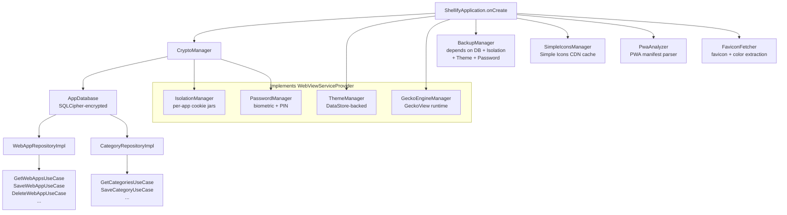

# app

> Android application module — the single deployable APK that wires every core and feature module together.

## Overview

The `:app` module is the entry point for Shellify. It owns no business logic of its own; instead it assembles the dependency graph, declares the navigation graph, and hosts `MainActivity`.

Key files:

- `ShellifyApplication.kt` — custom `Application` subclass; manual DI container using `lazy val`s; implements `WebViewServiceProvider`
- `presentation/MainActivity.kt` — single Compose activity; edge-to-edge, locale wrapping, theme reveal animation, `FLAG_SECURE` screenshot protection, deep-link handling
- `presentation/navigation/AppNavigation.kt` — `NavHost` with all route definitions and the bottom navigation bar (Home, Categories, Shortcuts, Settings)
- `presentation/navigation/Screen.kt` — sealed class of typed route strings
- `src/main/res/values/strings.xml` — English string resources
- `src/main/res/values-fr/strings.xml` — French translations
- `src/main/res/values-ar/strings.xml` — Arabic translations
- `src/main/res/xml/network_security_config.xml` — network security policy
- `src/main/res/xml/backup_rules.xml` — Auto-Backup inclusion/exclusion rules
- `src/main/res/xml/file_paths.xml` — `FileProvider` path configuration
- `src/androidTest/` — 8 smoke tests (navigation, consent gate, deep-link dialog, lifecycle)
- `src/test/` — Roborazzi screenshot tests (20 golden images across 6 screens)

Namespace: `io.shellify.app` | minSdk: 23 | targetSdk: 36

## Purpose

`:app` solves two problems:

1. **Dependency assembly** — no Hilt or Dagger; `ShellifyApplication` constructs every singleton exactly once using Kotlin `lazy`, in the correct order (crypto first, then database, then repositories, then use cases, then managers).
2. **Navigation shell** — it provides a stable `NavHost` that feature modules never need to import; features expose composables and the app module wires them to routes.

## Usage

### Running the app

```bash
./gradlew :app:installDebug
```

### Running instrumented smoke tests

```bash
./gradlew :app:connectedAndroidTest
```

### Running Roborazzi screenshot tests

```bash
# Record golden images (first time or after intentional UI change)
./gradlew :app:recordRoborazziDebug

# Verify screenshots match goldens (CI)
./gradlew :app:verifyRoborazziDebug
```

### Adding a new screen

1. Add an `object` to `Screen.kt` with its route string.
2. Add a `composable(Screen.NewScreen.route) { ... }` block in `AppNavigation.kt`.
3. If the screen needs DI objects, expose them through `ShellifyApplication` or pass them down from the `NavHost` lambda.

## Dependencies

### What `:app` depends on

| Category | Modules |
|---|---|
| Core | `:core:domain`, `:core:crypto`, `:core:security`, `:core:locale`, `:core:ui`, `:core:database`, `:core:engine`, `:core:isolation`, `:core:iconpack`, `:core:pwa`, `:core:shortcut`, `:core:deeplink`, `:core:translate`, `:core:theme`, `:core:backup` |
| Feature | `:feature:home`, `:feature:add`, `:feature:category`, `:feature:settings`, `:feature:onboarding`, `:feature:shortcuts`, `:feature:translate`, `:feature:webview`, `:feature:share`, `:feature:shortcut` |
| AndroidX | Compose BOM 2024.12.01, Navigation Compose, Lifecycle, Activity Compose, DataStore, Room runtime, AppCompat |
| Image | Coil 2.7.0 + SVG extension |
| Async | Kotlinx Coroutines 1.9.0 |

### What depends on `:app`

Nothing — it is the root of the dependency graph.

### Adding a new dependency

Add the version to `gradle/libs.versions.toml` under `[versions]`, declare the library under `[libraries]`, then reference it in `app/build.gradle.kts`:

```kotlin
// app/build.gradle.kts
dependencies {
    implementation(libs.my.new.library)
}
```

## Mermaid Diagram



## Configuration

| Item | Location | Notes |
|---|---|---|
| Application ID | `app/build.gradle.kts` → `applicationId` | `io.shellify.app` |
| Version name / code | `app/build.gradle.kts` → `defaultConfig` | Bump both for releases |
| ProGuard rules | `app/proguard-rules.pro` | Applied in `release` build type only |
| Network security | `res/xml/network_security_config.xml` | Restricts cleartext traffic |
| File sharing | `res/xml/file_paths.xml` | Required for backup file export via `FileProvider` |
| Detekt | `config/detekt/detekt.yml` (root) | Applied via `detekt { }` block in `build.gradle.kts` |
| Lint | `config/lint/lint.xml` (root) | Applied via `lint { lintConfig = ... }` |
| Screenshot goldens | `src/test/snapshots/` | Committed to VCS; regenerate with `recordRoborazziDebug` |
