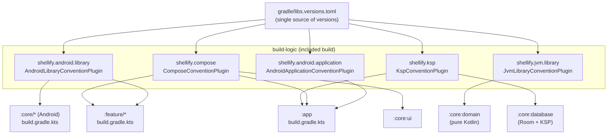

# build-logic

> Gradle convention plugins — define build rules once, apply them across all 26 modules with a single `id(...)` line.

## Overview

`build-logic` is an included Gradle build (`settings.gradle.kts` → `includeBuild("build-logic")`). It compiles five convention plugins that replace repetitive boilerplate in every module's `build.gradle.kts`.

Key files:

- `src/main/kotlin/AndroidApplicationConventionPlugin.kt` — configures the `:app` module
- `src/main/kotlin/AndroidLibraryConventionPlugin.kt` — configures every `core/*` and `feature/*` Android library module
- `src/main/kotlin/ComposeConventionPlugin.kt` — enables Compose BOM and the Kotlin Compose compiler plugin
- `src/main/kotlin/JvmLibraryConventionPlugin.kt` — configures pure-Kotlin modules (currently `:core:domain`)
- `src/main/kotlin/KspConventionPlugin.kt` — applies KSP; used by modules that need Room annotation processing
- `build.gradle.kts` — registers all five plugins with their IDs and `implementationClass`
- `settings.gradle.kts` — wires `libs.versions.toml` from `../gradle/` into the included build

Compiled against: Kotlin 2.0.21 | AGP 8.7.3 | JVM 17

## Purpose

Without convention plugins, every module would repeat the same 30-line AGP configuration block (compileSdk, minSdk, Java 17 compatibility, Kotlin JVM target, test runner). A mistake or upgrade in one place would require touching all 26 modules. `build-logic` solves this by centralising those decisions: change a value in one plugin file and every module that applies the plugin picks it up on the next sync.

The plugins enforce:

- `compileSdk = 36`, `minSdk = 23`, `targetSdk = 36` (app only) across the board
- `JavaVersion.VERSION_17` source/target compatibility
- `kotlinOptions.jvmTarget = "17"`
- A consistent default test instrumentation runner

## Usage

### Applying a plugin to a module

```kotlin
// any module's build.gradle.kts
plugins {
    id("shellify.android.library")   // Android library
    id("shellify.compose")           // add Compose support
    id("shellify.ksp")               // add KSP / Room support
}
```

That is the entire boilerplate for a feature module with Compose and Room.

### Adding a new module

1. Create the module directory and a minimal `build.gradle.kts` using one of the plugin IDs above.
2. Register the module in the root `settings.gradle.kts`:
   ```kotlin
   include(":feature:mynewfeature")
   ```
3. No changes to `build-logic` are needed unless the new module requires a behaviour that no existing plugin covers.

### Adding a new convention plugin

1. Create a new Kotlin file in `build-logic/src/main/kotlin/`, e.g. `RoomConventionPlugin.kt`.
2. Register it in `build-logic/build.gradle.kts`:
   ```kotlin
   gradlePlugin {
       plugins {
           register("shellifyRoom") {
               id = "shellify.room"
               implementationClass = "RoomConventionPlugin"
           }
       }
   }
   ```
3. Apply it in any module with `id("shellify.room")`.

## Dependencies

`build-logic` itself has compile-only dependencies on the AGP, Kotlin, Compose compiler, and KSP Gradle plugins — declared in `build-logic/build.gradle.kts`. It reads library versions from `gradle/libs.versions.toml` via the `versionCatalogs` block in `build-logic/settings.gradle.kts`.

Nothing in the main project depends on `build-logic` at runtime; it is only used during the Gradle configuration phase.

## Mermaid Diagram



## Configuration

| Setting | Where | Value |
|---|---|---|
| `compileSdk` | `AndroidApplicationConventionPlugin`, `AndroidLibraryConventionPlugin` | 36 |
| `minSdk` | Both Android plugins | 23 |
| `targetSdk` | Application plugin only | 36 |
| JVM target | All plugins | 17 |
| KSP schema output | `:app/build.gradle.kts` `ksp { arg(...) }` | `$projectDir/schemas` |

To change a global SDK level, edit the relevant plugin file and re-sync. The change propagates to all modules that apply the plugin automatically.
