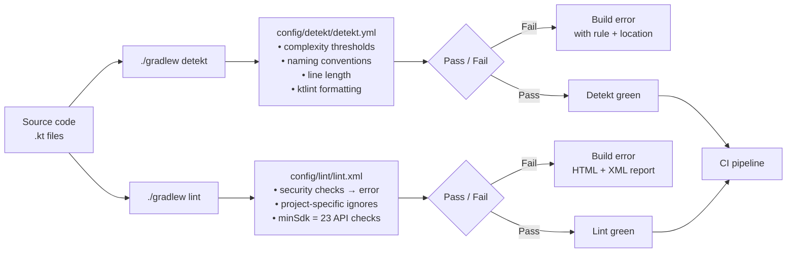

# config

> Static analysis configuration — Detekt and Android Lint rules applied consistently across every build.

## Overview

The `config/` directory holds two analysis tool configurations that are referenced from module `build.gradle.kts` files and from the root `build.gradle.kts`.

Key files:

- `detekt/detekt.yml` — Detekt 1.23.7 rule configuration; controls complexity thresholds, naming conventions, line-length limits, and ktlint-based formatting rules
- `lint/lint.xml` — Android Lint severity overrides; promotes security-related checks to errors, suppresses false positives specific to this project (Compose-only UI, SQLCipher, GeckoView dynamic loading, manual backup)

## Purpose

Centralising analysis config in `config/` means every module is checked against the same standards. Without it, each module would need its own config file or would rely on tool defaults — which differ between Detekt versions and do not capture project-specific exceptions.

- **Detekt** catches Kotlin code-quality issues: overly complex functions, naming violations, long parameter lists, missing explicit return types.
- **Android Lint** catches Android-specific bugs: insecure SharedPreferences commits, world-readable files, wrong API level usage, missing content descriptions.

Both tools are integrated in CI and must pass before a build is considered green.

## Usage

### Running Detekt

```bash
# Check all modules
./gradlew detekt

# Check a single module
./gradlew :core:crypto:detekt

# Auto-fix formatting issues (ktlint rules)
./gradlew detektBaseline
```

### Running Android Lint

```bash
# Check all modules
./gradlew lint

# Check a single module
./gradlew :app:lint

# Generate HTML report
./gradlew :app:lintDebug
# Report written to: app/build/reports/lint-results-debug.html
```

### Suppressing a Detekt rule inline

```kotlin
@Suppress("LongMethod")
fun myLongButNecessaryFunction() { ... }
```

### Suppressing a Detekt rule project-wide

Add an exclusion under the relevant rule in `config/detekt/detekt.yml`:

```yaml
complexity:
  LongMethod:
    ignoreAnnotated:
      - 'Composable'   # already present
      - 'MyAnnotation' # add your annotation here
```

### Suppressing an Android Lint warning

Add an `<issue>` entry to `config/lint/lint.xml`:

```xml
<!-- Explain why this is suppressed -->
<issue id="TheIssueId" severity="ignore" />
```

## Dependencies

`detekt.yml` is referenced from every module that applies `detekt { config.setFrom(...) }` in its `build.gradle.kts`. The `:app` module is the primary consumer; the path is always `${rootDir}/config/detekt/detekt.yml`.

`lint.xml` is referenced from `:app/build.gradle.kts` via `lint { lintConfig = file("${rootDir}/config/lint/lint.xml") }`. Other modules inherit the root lint configuration automatically.

External tool versions:

| Tool | Version |
|---|---|
| Detekt | 1.23.7 |
| Detekt formatting (ktlint) | same as `detekt` in `libs.versions.toml` |
| Android Lint | bundled with AGP 8.7.3 |

## Mermaid Diagram



## Configuration

### detekt.yml highlights

| Rule | Threshold / Setting |
|---|---|
| `CognitiveComplexMethod` | 15 |
| `CyclomaticComplexMethod` | 15 |
| `LongMethod` | 60 lines (Composable functions excluded) |
| `LongParameterList` | 8 params (data classes and Composables excluded) |
| `LargeClass` | 600 lines |
| `MaxLineLength` | 140 characters |
| `LabeledExpression` | disabled (project uses labeled returns in coroutine lambdas) |

### lint.xml highlights

| Category | Rule | Severity |
|---|---|---|
| Security | `SecureRandom`, `TrulyRandom`, `HardcodedDebugMode`, `WorldReadableFiles` | error |
| API level | `NewApi` | error |
| Correctness | `Recycle`, `WrongConstant`, `StringFormatInvalid` | error |
| Disabled | `UnusedIds` | ignore (Compose-only project) |
| Disabled | `UnsafeDynamicallyLoadedCode` | ignore (GeckoView loads `.so` at runtime intentionally) |
| Disabled | `SQLiteString` | ignore (SQLCipher replaces standard SQLite) |
| Disabled | `AllowBackup` | ignore (manual backup via `BackupManager`) |
