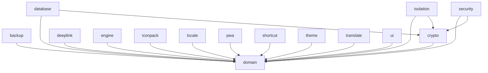

# core

> Infrastructure and domain modules — the foundation of Shellify's Clean Architecture

## Overview

The `core/` directory contains **14 modules** split into two conceptual layers:

- **Domain layer** (`core:domain`) — pure Kotlin, no Android dependencies, defines all entities, repository interfaces, and use cases.
- **Infrastructure layer** (the remaining 13 modules) — Android library modules that implement the domain interfaces, provide platform services, and expose UI primitives.

| Module | Responsibility |
|---|---|
| `domain` | Entities, repository interfaces, use cases — the app's pure business logic |
| `database` | Room + SQLCipher encrypted persistence |
| `crypto` | AES-256-GCM encryption via Android Keystore |
| `security` | Password hashing, biometric auth, per-app lock state |
| `backup` | Export / import encrypted backups |
| `deeplink` | Deep-link parsing, validation, and confirmation flow |
| `engine` | WebView / GeckoView engine abstraction |
| `iconpack` | Icon pack resolution and rendering |
| `isolation` | Per-app cookie/storage isolation |
| `locale` | Locale switching and i18n utilities |
| `pwa` | PWA manifest fetching and parsing |
| `shortcut` | Android home-screen shortcut management |
| `theme` | Dynamic theming, color extraction, dark/light mode |
| `translate` | In-page translation integration |
| `ui` | Shared Compose components, design tokens, theming wrappers |

## Purpose

All application logic that is **not feature-specific** lives here. Features depend on `core:domain` for contracts and on the app's DI layer to receive infrastructure implementations — they never import `core:*` infrastructure modules directly.

## Dependency Rule

```
core:* (infrastructure) → core:domain
feature:* → core:domain (via DI only)
app → core:* (wires DI)
```

`core:domain` is the **sole** pure-Kotlin module (`shellify.jvm.library` convention plugin). All other core modules use the `shellify.android.library` convention plugin.

## Usage

### Adding a new core module

1. Create a directory under `core/`.
2. Add a `build.gradle.kts` with the `shellify.android.library` convention plugin.
3. Register it in the root `settings.gradle.kts`:
   ```kotlin
   include(":core:my-module")
   ```
4. Define any new domain contracts (interfaces, models) in `core:domain` first.
5. Implement those contracts in the new module; expose bindings via a Hilt module.

### Adding a dependency on an existing core module

In a feature or app module's `build.gradle.kts`:
```kotlin
dependencies {
    implementation(project(":core:domain"))   // always safe from features
    // infrastructure modules: prefer injection over direct dependency
}
```

## Mermaid Diagram



## Configuration

Each infrastructure module is wired at the `:app` level through Hilt `@Module` / `@Binds` declarations. No configuration is needed inside `core/` itself — convention plugins handle compilation settings, lint, and test setup uniformly across all modules.
