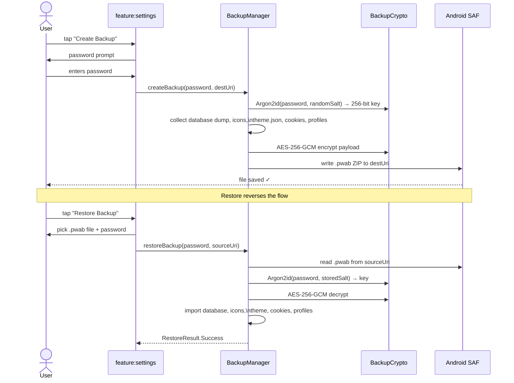

# `core:backup`

> Encrypted, portable backup and restore of all Shellify app data using Argon2id + AES-256-GCM

## Overview

`core:backup` lets users export the entirety of their Shellify data — installed PWAs, icons, theme settings, and isolated per-app cookies — into a single password-protected `.pwab` archive. The archive is portable across devices. Restoration decrypts and re-imports everything, re-generating device-specific secrets locally.

- Namespace: `io.shellify.core.backup`
- Convention plugin: `shellify.android.library`

## Purpose

- Allow users to migrate to a new device without losing any app data
- Provide scheduled automatic backups (weekly / monthly) via WorkManager
- Encrypt all sensitive data (cookies, settings) before writing to external storage
- Avoid storing device-specific secrets in the backup so it is safe to share

## Key Classes / Files

| Class | Description |
|---|---|
| `BackupManager` | Orchestrates backup creation and restoration. Accepts a user-supplied password; derives a 256-bit key via Argon2id; encrypts the payload with AES-256-GCM; writes the result to a `.pwab` file via Android SAF. Restore reverses the process. Both operations are `suspend` functions. |
| `BackupCrypto` | Argon2id key derivation + AES-256-GCM encrypt/decrypt. Intentionally separate from `core:crypto` (which is Keystore-bound and non-exportable). Salt is randomly generated per backup and stored unencrypted in the archive header. |
| `BackupSettings` | DataStore-backed preferences for backup schedule: `MANUAL`, `WEEKLY`, or `MONTHLY`. |
| `BackupScheduler` | WorkManager `CoroutineWorker` that triggers `BackupManager.createBackup()` on the configured cadence. |

### `.pwab` archive format

```
.pwab (ZIP container, AES-256-GCM encrypted entries)
├── header.json          — version, Argon2id salt, GCM nonce
├── database.dump        — SQLite dump of core:database
├── icons/               — PNG/SVG icon files
├── theme.json           — ThemeMode, accentColor, selectedLanguage
├── cookies/             — Encrypted per-app cookie jars (re-encrypted under backup key)
└── profiles/            — WebView profile dirs (API 33+ only)
```

### What is NOT backed up

| Item | Reason |
|---|---|
| App password hash | Device-specific; re-set on first launch after restore |
| Database passphrase | Regenerated from device Keystore on new device |
| Backup password | Never stored anywhere |

## Dependencies

```kotlin
// core/backup/build.gradle.kts
dependencies {
    api(project(":core:domain"))
    implementation(project(":core:database"))
    implementation(project(":core:crypto"))
    implementation(project(":core:security"))
    implementation(project(":core:isolation"))
    implementation(project(":core:iconpack"))
    implementation(project(":core:theme"))
    implementation("com.google.code.gson:gson:<version>")
    implementation("androidx.work:work-runtime-ktx:<version>")
    implementation("androidx.documentfile:documentfile:<version>")
}
```

## Usage

**Creating a backup:**

```kotlin
// User picks a folder via SAF; destUri comes from ActivityResultContracts.OpenDocumentTree
backupManager.createBackup(password = "hunter2", destUri = pickedFolderUri)
```

**Restoring from a backup:**

```kotlin
// User picks the .pwab file via SAF
backupManager.restoreBackup(password = "hunter2", sourceUri = pickedFileUri)
```

**Scheduling automatic backups:**

```kotlin
backupSettings.setSchedule(BackupSchedule.WEEKLY)
// BackupScheduler registers/cancels the WorkManager job automatically
```

**Cancelling a scheduled backup:**

```kotlin
backupSettings.setSchedule(BackupSchedule.MANUAL)
```

## Mermaid Diagram



## Configuration

| Item | Value / Notes |
|---|---|
| Archive file extension | `.pwab` |
| Encryption | AES-256-GCM |
| Key derivation | Argon2id (memory-hard; parameters tuned for mobile) |
| Key size | 256 bits |
| Salt storage | Unencrypted in `header.json` inside the archive |
| GCM nonce | Random per backup; stored in `header.json` |
| Backup schedules | `MANUAL`, `WEEKLY`, `MONTHLY` |
| Storage access | Android Storage Access Framework (no `WRITE_EXTERNAL_STORAGE`) |
| WorkManager tag | `"shellify_scheduled_backup"` |

**Consumers:** `feature:settings` (backup/restore UI), `feature:onboarding` (optional backup setup step during first launch).
