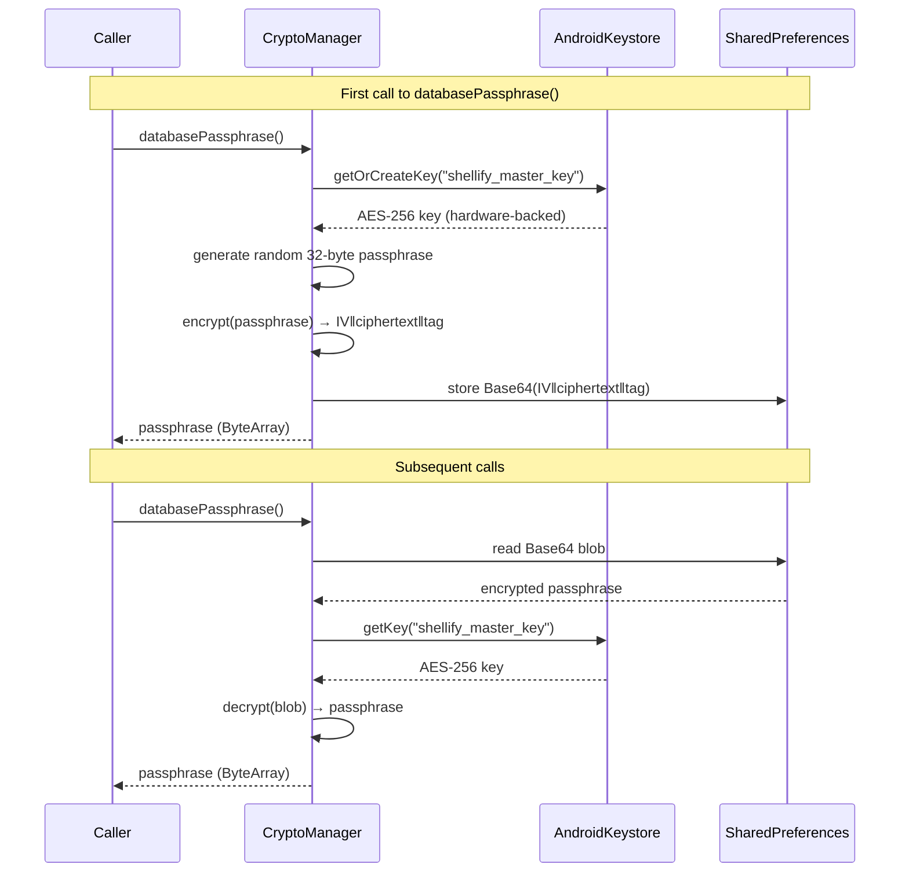

# core:crypto

> AES-256-GCM encryption backed by the Android Keystore — the cryptographic foundation of Shellify

## Overview

`core:crypto` provides authenticated encryption for all sensitive data in the app. It relies exclusively on the **Android Keystore** and `javax.crypto` — no third-party cryptography library is introduced. The master key is generated once per device and is hardware-backed on devices that support a Trusted Execution Environment (TEE) or StrongBox.

- Convention plugin: `shellify.android.library`
- Namespace: `io.shellify.core.crypto`

## Purpose

Centralise all cryptographic operations so that:

- Encryption algorithm choices are made in one place.
- Key material never appears in plaintext in memory longer than necessary.
- Modules that need encryption (`database`, `isolation`, `backup`) consume a simple API without knowing Keystore internals.

## Key Classes / Files

### `CryptoManager`

The single public entry point for this module.

| Method | Description |
|---|---|
| `encrypt(plaintext: ByteArray): ByteArray` | Returns `IV (12 B) \|\| ciphertext \|\| GCM tag (16 B)` |
| `decrypt(ciphertext: ByteArray): ByteArray` | Parses the wire format above and decrypts + authenticates |
| `encryptString(value: String): String` | Base64-encodes the result of `encrypt()` for storage in text fields |
| `decryptString(value: String): String` | Inverse of `encryptString()` |
| `databasePassphrase(): ByteArray` | Returns a stable 32-byte key for SQLCipher; generated on first call, encrypted and stored in `SharedPreferences`; subsequent calls decrypt from storage using the Keystore key |

**Wire format:**
```
[ 12-byte IV ][ AES-256-GCM ciphertext ][ 16-byte authentication tag ]
```

The GCM authentication tag prevents any undetected tampering with the ciphertext.

**Android Keystore key properties:**
- Algorithm: `AES`
- Key size: 256 bits
- Block mode: `GCM`
- Padding: `NoPadding`
- User authentication: not required (app-level lock is handled by `core:security`)
- Hardware-backed: yes, when the device provides a TEE or StrongBox

## Dependencies

```kotlin
// build.gradle.kts (core:crypto)
dependencies {
    implementation(libs.androidx.core.ktx)
    // No external crypto library — uses Android Keystore + javax.crypto
}
```

## Usage

### Encrypting arbitrary data

```kotlin
@Inject lateinit var cryptoManager: CryptoManager

val encrypted: ByteArray = cryptoManager.encrypt("sensitive value".toByteArray())
val decrypted: String = cryptoManager.decrypt(encrypted).toString(Charsets.UTF_8)
```

### Obtaining the SQLCipher passphrase

```kotlin
// Injected into AppDatabase builder (in DatabaseModule.kt)
val passphrase: ByteArray = cryptoManager.databasePassphrase()
```

### Extending encryption to a new module

1. Inject `CryptoManager` via Hilt.
2. Call `encryptString` / `decryptString` for text storage, or `encrypt` / `decrypt` for binary blobs.
3. Do **not** create a second Keystore key — reuse the one managed by `CryptoManager`.

## Mermaid Diagram



## Configuration

No runtime configuration is needed. The Keystore alias (`shellify_master_key`) is a compile-time constant inside `CryptoManager`. If you need to rotate the master key (e.g. after a security incident), provide a migration path that:

1. Decrypts all existing `SharedPreferences` blobs with the old key.
2. Generates a new Keystore key under a versioned alias.
3. Re-encrypts all blobs with the new key.
4. Deletes the old Keystore entry.

This migration must be coordinated with `core:database` (SQLCipher passphrase rotation requires a full database re-key).
