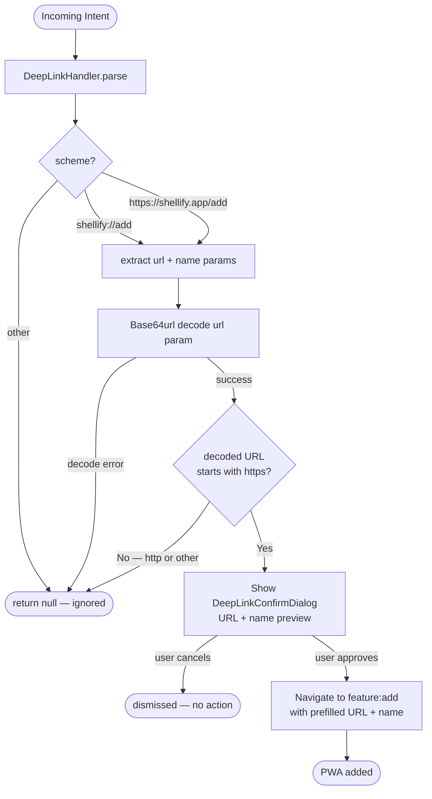

# `core:deeplink`

> Deep-link parsing, URI building, and QR code generation for sharing PWA shortcuts

## Overview

`core:deeplink` handles all inbound deep links that carry a PWA URL into Shellify. It parses both the custom `shellify://` scheme and the universal `https://shellify.app/add` link format, validates the payload, and — for security — always surfaces a confirmation dialog before acting. It also generates QR code `Bitmap` objects from URLs using ZXing so users can share apps with nearby devices.

- Namespace: `io.shellify.core.deeplink`
- Convention plugin: `shellify.android.library`

## Purpose

- Let users share a PWA install link (as a URL or QR code) with anyone
- Safely ingest external deep links without allowing silent app installs
- Validate the embedded URL (HTTPS-only; Base64url decoded; no HTTP)
- Provide QR code generation for the share sheet in `feature:share`

## Key Classes / Files

| Class | Description |
|---|---|
| `DeepLinkHandler` | Parses incoming `Intent` URIs. Supports the `shellify://add?url=<base64url>&name=<name>` scheme and the `https://shellify.app/add?url=...` universal link. Decodes Base64url (URL-safe, no padding). Validates that the decoded URL uses HTTPS — HTTP is rejected. Returns `Pair<url, name>` or `null` for invalid input. |
| `QrCodeGenerator` | Wraps ZXing Core 3.5.3. `generate(url: String, sizePx: Int): Bitmap` encodes the URL as a QR code and returns a `Bitmap` ready for display or sharing. |

### Deep-link URI format

```
shellify://add?url=<base64url-encoded-https-url>&name=<display-name>

Example:
  Raw URL   : https://youtube.com
  Base64url  : aHR0cHM6Ly95b3V0dWJlLmNvbQ   (no + / = padding)
  Deep link  : shellify://add?url=aHR0cHM6Ly95b3V0dWJlLmNvbQ&name=YouTube
```

### Security rules enforced by `DeepLinkHandler`

| Check | Behaviour on failure |
|---|---|
| Base64url decoding | Returns `null` — link ignored |
| Decoded URL scheme must be `https` | Returns `null` — HTTP rejected |
| Confirmation dialog | Always shown; user must approve before app is added |

## Dependencies

```kotlin
// core/deeplink/build.gradle.kts
dependencies {
    api(project(":core:domain"))
    implementation(project(":core:security"))
    implementation("androidx.core:core-ktx:<version>")
    implementation("com.google.zxing:core:3.5.3")
}
```

## Usage

**Handling an incoming Intent in MainActivity:**

```kotlin
override fun onNewIntent(intent: Intent) {
    super.onNewIntent(intent)
    val result: Pair<String, String>? = deepLinkHandler.parse(intent)
    result?.let { (url, name) ->
        // DeepLinkHandler guarantees confirmation dialog is shown
        navController.navigate(AddScreen(prefillUrl = url, prefillName = name))
    }
}
```

**Generating a QR code for the share sheet:**

```kotlin
val qrBitmap: Bitmap = qrCodeGenerator.generate(
    url    = "shellify://add?url=${base64url(app.startUrl)}&name=${app.name}",
    sizePx = 512
)
```

**Building a shareable deep link programmatically:**

```kotlin
val deepLink = "shellify://add?url=${Base64.encodeUrl(app.startUrl)}&name=${app.name}"
```

## Mermaid Diagram



## Configuration

| Item | Value / Notes |
|---|---|
| Custom URI scheme | `shellify://` |
| Universal link host | `shellify.app` |
| Base64 variant | URL-safe, no padding (`Base64.URL_SAFE or Base64.NO_PADDING`) |
| HTTP rejection | Hard rejection — only `https://` URLs accepted |
| QR code library | ZXing Core `3.5.3` |
| QR code format | `BarcodeFormat.QR_CODE` |
| Confirmation dialog | `DeepLinkConfirmDialog` (in `feature:add`) — always shown |

**Consumers:** `app` (`MainActivity` receives and dispatches deep links), `feature:share` (QR code and link export), `feature:add` (receives the parsed URL and name as navigation arguments).
