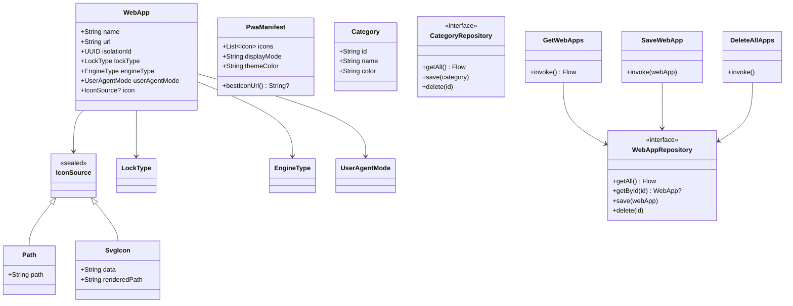

# core:domain

> Pure Kotlin business logic — entities, repository contracts, and use cases with zero Android dependencies

## Overview

`core:domain` is the **innermost ring** of Shellify's Clean Architecture. It contains every model, interface, and use case that describes *what the app does* — completely decoupled from Android, Room, or any framework.

- Convention plugin: `shellify.jvm.library`
- Namespace: `io.shellify.app.domain`
- No Android dependencies — compiles to a plain JVM library

## Purpose

Every other module depends on `core:domain`, either to consume its models or to implement its repository interfaces. This keeps the dependency graph acyclic and makes the business rules testable with plain JUnit without Robolectric.

## Key Classes / Files

### Models

| Class | Description |
|---|---|
| `WebApp` | Primary entity: `name`, `url`, `isolationId` (UUID), fullscreen flags, ad-block settings, translation config, `LockType`, `UserAgentMode`, theme colors, `EngineType` |
| `PwaManifest` | Parsed PWA manifest — icon list, display mode, colors; `bestIconUrl()` prefers maskable → any → largest |
| `Category` | Groups of web apps: `id`, `name`, `color` |
| `IconSource` | Sealed class: `Path(path)`, `SvgIcon(data, renderedPath)`, or `null` |

### Enums

| Enum | Values |
|---|---|
| `LockType` | `NONE`, `PASSWORD`, `SYSTEM` |
| `EngineType` | `SYSTEM_WEBVIEW`, `GECKOVIEW` |
| `UserAgentMode` | `DEFAULT`, `DESKTOP`, `MOBILE`, `CUSTOM` (each with an associated UA string) |
| `TranslateLanguage` | 16 language codes (e.g. `EN`, `FR`, `DE`, `AR`, …) |

### Repository Interfaces

| Interface | Key methods |
|---|---|
| `WebAppRepository` | `getAll(): Flow<List<WebApp>>`, `getById(id)`, `save(webApp)`, `delete(id)` |
| `CategoryRepository` | `getAll(): Flow<List<Category>>`, `save(category)`, `delete(id)` |

### Use Cases (10+)

`GetWebApps`, `GetWebAppById`, `SaveWebApp`, `DeleteAllApps`, `GetCategories`, `SaveCategory`, `DeleteCategory`, and several more — each wrapping a single repository operation to keep features thin.

## Dependencies

```kotlin
// build.gradle.kts (core:domain)
dependencies {
    implementation(libs.kotlinx.coroutines.core)
    implementation(libs.kotlinx.serialization.json) // PwaManifest parsing
}
```

No Android dependency is permitted here. Any PR adding `android.*` or `androidx.*` imports to this module should be rejected.

## Usage

### Consuming a use case (from a feature ViewModel)

```kotlin
@HiltViewModel
class HomeViewModel @Inject constructor(
    private val getWebApps: GetWebApps
) : ViewModel() {
    val apps = getWebApps().stateIn(viewModelScope, SharingStarted.Lazily, emptyList())
}
```

### Implementing a repository (in an infrastructure module)

```kotlin
class WebAppRepositoryImpl @Inject constructor(
    private val dao: WebAppDao,
    private val mapper: WebAppMapper
) : WebAppRepository {
    override fun getAll(): Flow<List<WebApp>> =
        dao.getAllAsFlow().map { it.map(mapper::toDomain) }
    // …
}
```

### Adding a new use case

1. Create a class under `usecase/` that takes one or more repository interfaces as constructor parameters.
2. Expose a single `operator fun invoke(…)` (suspend or Flow).
3. Bind it in the Hilt module inside `core:database` or whichever infrastructure module owns the repository.

## Mermaid Diagram



## Configuration

No runtime configuration required. To add a new language to `TranslateLanguage`, add the ISO code to the enum and supply the corresponding UI string in all `strings.xml` resource files.
