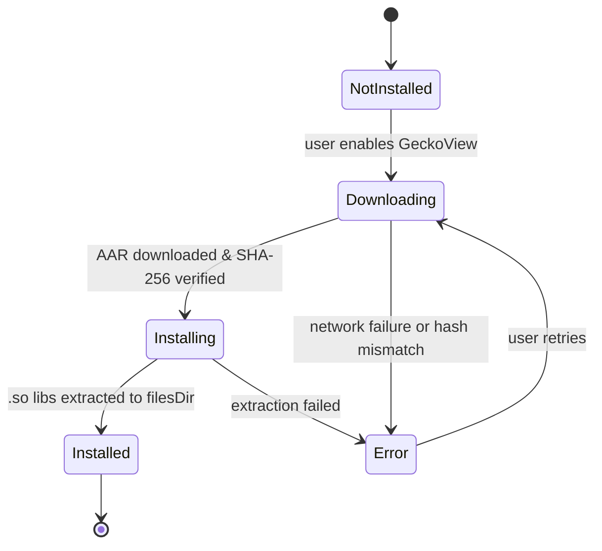

# `core:engine`

> Browser engine abstraction layer supporting System WebView and Mozilla GeckoView, with Tor proxy integration via Guardian Project tor-android

## Overview

`core:engine` provides a unified interface for embedding web content in Shellify. It abstracts over two distinct browser backends — Android's built-in System WebView and Mozilla GeckoView — so the rest of the app remains agnostic to the underlying rendering engine. GeckoView is downloaded and installed at runtime (not bundled) to keep the base APK lightweight.

- Namespace: `io.shellify.core.engine`
- Convention plugin: `shellify.android.library`

## Purpose

- Decouple feature modules from specific browser engine APIs
- Enable optional GeckoView adoption without touching feature code
- Provide ad-blocking at the network request level, before content is rendered
- Support user-agent overrides for full PWA compatibility

## Key Classes / Files

| Class | Description |
|---|---|
| `BrowserEngine` | Interface implemented by both engine backends. Declares `loadUrl()`, `goBack()`, `goForward()`, `reload()`, and engine lifecycle methods. |
| `BrowserEngineCallback` | Callback interface for page load progress, network errors, DOM change events, and network request interception (`onRequestIntercepted(url, blocked)`). |
| `GeckoViewEngine` | `BrowserEngine` implementation backed by Mozilla GeckoView. |
| `SystemWebViewEngine` | `BrowserEngine` implementation backed by `android.webkit.WebView`. |
| `GeckoEngineManager` | Downloads GeckoView 128.0.20240704121409 from `maven.mozilla.org`; detects device ABI (`arm64-v8a`, `armeabi-v7a`, `x86_64`, `x86`); SHA-256 verifies the downloaded AAR; extracts native `.so` libraries to `filesDir/gecko_engine/lib/$abi/`; exposes a `StateFlow<GeckoInstallState>` for UI observation. |
| `WebViewManager` | Factory that creates and configures `WebView` instances: applies ad-block injection, sets the custom user-agent, and wires the `BrowserEngineCallback`. |
| `AdBlocker` | EasyList-based blocker. Core API: `block(url: String, contentType: String): Boolean`. Supports per-app custom rules. |
| `AdBlockFilterCache` | Two-tier cache: in-memory LRU + disk persistence. Reduces filter list parse overhead on cold start. |

### GeckoInstallState

```
NotInstalled → Downloading → Installing → Installed
                                        ↘ Error
```

Native libraries (`libxul.so`, etc.) are intentionally excluded from the main APK via `packagingOptions` and are loaded dynamically after the user triggers GeckoView installation.

## Dependencies

```kotlin
// core/engine/build.gradle.kts
dependencies {
    api(project(":core:domain"))
    implementation("org.mozilla.geckoview:geckoview:128.0.20240704121409")
    implementation("com.squareup.okhttp3:okhttp:<version>")
    implementation("androidx.webkit:webkit:<version>")
}
```

## Usage

**Engine selection (feature:settings toggle):**

```kotlin
val engine: BrowserEngine = if (geckoInstalled) {
    GeckoViewEngine(context, callback)
} else {
    SystemWebViewEngine(context, callback)
}
```

**Observing GeckoView install state:**

```kotlin
geckoEngineManager.installState.collect { state ->
    when (state) {
        is GeckoInstallState.Downloading -> showProgress(state.percent)
        is GeckoInstallState.Installed   -> enableGeckoOption()
        is GeckoInstallState.Error       -> showError(state.message)
        else -> Unit
    }
}
```

**Ad-block check (called from WebViewClient.shouldInterceptRequest):**

```kotlin
val blocked = adBlocker.block(request.url.toString(), contentType)
if (blocked) return WebResourceResponse(null, null, null)
```

**Adding a per-app custom filter rule:**

```kotlin
adBlocker.addCustomRule(appId, "||ads.example.com^")
```

## Mermaid Diagram



## Configuration

| Item | Value / Location |
|---|---|
| GeckoView version | `128.0.20240704121409` |
| Maven repository | `https://maven.mozilla.org/maven2` |
| Native lib output path | `filesDir/gecko_engine/lib/$abi/` |
| ABI list | `arm64-v8a`, `armeabi-v7a`, `x86_64`, `x86` |
| EasyList source | Bundled in `assets/easylist.txt`; updated via `AdBlockFilterCache` |
| Native libs in APK | Excluded via `packagingOptions { exclude "**/*.so" }` |

**Consumers:** `app` (GeckoEngineManager init on startup), `feature:webview` (engine selection + Tor routing), `feature:settings` (engine toggle + Tor toggle), `feature:add` (site preview).

## Tracker Blocking (Phase 2 additions)

`AdBlockFilterCache` now carries a **parallel tracker rule set** alongside the existing ad-block rule set. The tracker set is loaded at application startup from the bundled `assets/easyprivacy_domains.txt` asset and is independent from the ad-block rules.

### New API on `AdBlockFilterCache`

| Method | Description |
|--------|-------------|
| `loadTrackerRules(lines: Sequence<String>)` | Parses a sequence of lines (comments starting with `#` and blank lines are skipped), lowercases each entry, strips a leading `www.` prefix, and adds it to the internal `blockedTrackerHosts` set. |
| `shouldBlockTracker(url: String): Boolean` | Extracts the host from `url` via the existing `extractHost()` helper and returns `true` if the host is present in `blockedTrackerHosts`. Does not evaluate pattern rules — tracker blocking is host-exact only. |

The existing `shouldBlock(url)` method is unchanged and continues to evaluate both host and pattern rules for the ad-block rule set.

### `trackerBlockingEnabled` parameter on `AdBlocker.shouldBlock`

`AdBlocker.shouldBlock(request, trackerBlockingEnabled)` now accepts a per-app flag:
- When `trackerBlockingEnabled = false` (default): only ad-block rules are evaluated.
- When `trackerBlockingEnabled = true`: also evaluates `cache.shouldBlockTracker(url)` — returns an empty response if the host is in the tracker set.

`SystemWebViewEngine` threads `app.trackerBlockingEnabled` from the active `WebApp` into this parameter.

### `easyprivacy_domains.txt` asset

Bundled at `core/engine/src/main/assets/easyprivacy_domains.txt`. Contains a curated static subset of high-impact tracking domains from the EasyPrivacy list (≥ 145 entries). Attribution: EasyPrivacy authors (CC BY-SA 3.0). Loaded during `AdBlocker` initialisation in `ShellifyApplication` via `runCatching { }` so a corrupted or missing asset falls back to an empty tracker set — fail-open for tracker rules; ad-block rules are unaffected.

---

## Tor Integration (Phase 2 additions)

`core:engine` now includes a full Tor daemon lifecycle stack backed by [Guardian Project](https://guardianproject.info) libraries:

- `info.guardianproject:tor-android:0.4.9.8` — embeds the Tor binary as an Android Service
- `info.guardianproject:jtorctl:0.4.5.7` — Java control connection for sending NEWNYM signals

### ProxyConfig

`sealed class ProxyConfig` — proxy configuration type used as the cache key in `GeckoEngineManager`.

| Subtype | Description |
|---------|-------------|
| `ProxyConfig.None` | No proxy (default; data object singleton) |
| `ProxyConfig.Socks5(host, port)` | SOCKS5 proxy — used for Tor (`host=127.0.0.1, port=9050`) |
| `ProxyConfig.Http(host, port)` | HTTP/HTTPS proxy (future use) |

Data-class equality is used as the cache key: identical `ProxyConfig` values always return the same `GeckoRuntime` instance.

### TorState

`sealed class TorState` — Tor daemon lifecycle state exposed as `StateFlow<TorState>` from `TorManager`.

| Subtype | Description |
|---------|-------------|
| `TorState.Stopped` | Daemon not running (initial state) |
| `TorState.Connecting` | Daemon starting, circuit not yet established |
| `TorState.Ready` | Circuit established; `loadUrl()` is unblocked |
| `TorState.Error(message)` | Error (e.g. NEWNYM failed) |

### TorManager

`TorManager` manages the Tor daemon lifecycle and exposes `StateFlow<TorState>` for UI observation.

**Public API:**

| Method | Description |
|--------|-------------|
| `ensureStarted(appId, preserveIdentity)` | Starts TorService (as foreground service) when the first Tor-enabled app opens |
| `releaseApp(appId, preserveIdentity)` | Schedules daemon shutdown after `GRACE_PERIOD_MS` (30s) when last non-preserve app closes |
| `registerPreserveIdentityApp(appId)` | Registers an app that keeps the daemon alive indefinitely |
| `unregisterPreserveIdentityApp(appId)` | Removes a preserve-identity registration |
| `newIdentity()` | Sends `NEWNYM` signal via `TorControlConnection` to rotate the Tor circuit |
| `torState: StateFlow<TorState>` | Observable daemon state; consumers gate `loadUrl()` until `TorState.Ready` |

**Key design decisions:**
- `TorManager` does NOT create its own `OkHttpClient` (per CONCERNS.md — there are already 4 independent instances; this would be a 5th).
- All blocking work runs on `Dispatchers.IO`.
- TorService is always promoted to foreground via `startForegroundService()` — redundant if TorService self-promotes, harmless as a no-op (T-02-21).
- `releaseApp(preserveIdentity=true)` never schedules shutdown regardless of active app count.

### GeckoEngineManager — Multi-Runtime Cache (Refactor)

`GeckoEngineManager` was refactored from a single `@Volatile sharedRuntime: GeckoRuntime?` to a `ConcurrentHashMap<ProxyConfig, GeckoRuntime>`.

**Before:** Single runtime shared by all apps — cannot support per-app proxy configuration.

**After:** `getRuntime(proxyConfig: ProxyConfig = ProxyConfig.None): GeckoRuntime` returns a cached runtime keyed by `ProxyConfig`. Identical configs return the same instance; different configs produce independent runtimes (Tor traffic never shares a runtime with non-Tor traffic — T-02-20).

**SOCKS5 proxy strategy:** Per Plan 04 Task 0 (blocking-human checkpoint — GeckoView 140 Javadoc verified), `GeckoRuntimeSettings.Builder` in GeckoView 140 has no `.proxyHost()`/`.proxyPort()` methods. The verified approach sets JVM system properties **before** `GeckoRuntime.create()`:

```kotlin
System.setProperty("socksProxyHost", "127.0.0.1")
System.setProperty("socksProxyPort", "9050")
```

This is process-scoped but acceptable since only one Tor runtime exists per process.

**Back-compat:** All existing callers of `getRuntime()` continue to work via the `ProxyConfig.None` default argument.

