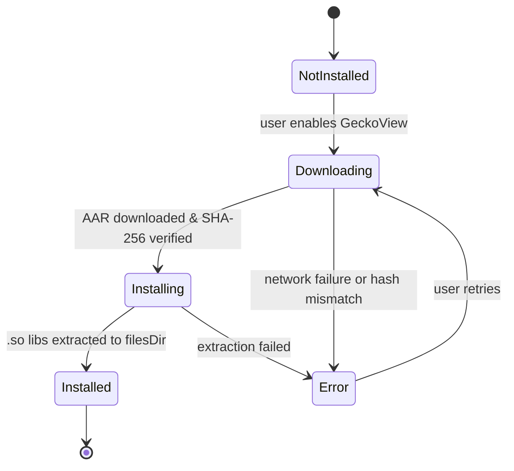

# `core:engine`

> Browser engine abstraction layer supporting System WebView and Mozilla GeckoView

## Overview

`core:engine` provides a unified interface for embedding web content in Shellify. It abstracts over two distinct browser backends — Android's built-in System WebView and Mozilla GeckoView — so the rest of the app remains agnostic to the underlying rendering engine. GeckoView is downloaded and installed at runtime (not bundled) to keep the base APK lightweight.

- Namespace: `io.shellify.core.engine`
- Convention plugin: `shellify.android.library`

## Purpose

- Decouple feature modules from specific browser engine APIs
- Enable optional GeckoView adoption without touching feature code
- Provide ad-blocking at the network request level, before content is rendered
- Support user-agent overrides for full PWA compatibility

## Key Classes / Files

| Class | Description |
|---|---|
| `BrowserEngine` | Interface implemented by both engine backends. Declares `loadUrl()`, `goBack()`, `goForward()`, `reload()`, and engine lifecycle methods. |
| `BrowserEngineCallback` | Callback interface for page load progress, network errors, DOM change events, and network request interception (`onRequestIntercepted(url, blocked)`). |
| `GeckoViewEngine` | `BrowserEngine` implementation backed by Mozilla GeckoView. |
| `SystemWebViewEngine` | `BrowserEngine` implementation backed by `android.webkit.WebView`. |
| `GeckoEngineManager` | Downloads GeckoView 128.0.20240704121409 from `maven.mozilla.org`; detects device ABI (`arm64-v8a`, `armeabi-v7a`, `x86_64`, `x86`); SHA-256 verifies the downloaded AAR; extracts native `.so` libraries to `filesDir/gecko_engine/lib/$abi/`; exposes a `StateFlow<GeckoInstallState>` for UI observation. |
| `WebViewManager` | Factory that creates and configures `WebView` instances: applies ad-block injection, sets the custom user-agent, and wires the `BrowserEngineCallback`. |
| `AdBlocker` | EasyList-based blocker. Core API: `block(url: String, contentType: String): Boolean`. Supports per-app custom rules. |
| `AdBlockFilterCache` | Two-tier cache: in-memory LRU + disk persistence. Reduces filter list parse overhead on cold start. |

### GeckoInstallState

```
NotInstalled → Downloading → Installing → Installed
                                        ↘ Error
```

Native libraries (`libxul.so`, etc.) are intentionally excluded from the main APK via `packagingOptions` and are loaded dynamically after the user triggers GeckoView installation.

## Dependencies

```kotlin
// core/engine/build.gradle.kts
dependencies {
    api(project(":core:domain"))
    implementation("org.mozilla.geckoview:geckoview:128.0.20240704121409")
    implementation("com.squareup.okhttp3:okhttp:<version>")
    implementation("androidx.webkit:webkit:<version>")
}
```

## Usage

**Engine selection (feature:settings toggle):**

```kotlin
val engine: BrowserEngine = if (geckoInstalled) {
    GeckoViewEngine(context, callback)
} else {
    SystemWebViewEngine(context, callback)
}
```

**Observing GeckoView install state:**

```kotlin
geckoEngineManager.installState.collect { state ->
    when (state) {
        is GeckoInstallState.Downloading -> showProgress(state.percent)
        is GeckoInstallState.Installed   -> enableGeckoOption()
        is GeckoInstallState.Error       -> showError(state.message)
        else -> Unit
    }
}
```

**Ad-block check (called from WebViewClient.shouldInterceptRequest):**

```kotlin
val blocked = adBlocker.block(request.url.toString(), contentType)
if (blocked) return WebResourceResponse(null, null, null)
```

**Adding a per-app custom filter rule:**

```kotlin
adBlocker.addCustomRule(appId, "||ads.example.com^")
```

## Mermaid Diagram



## Configuration

| Item | Value / Location |
|---|---|
| GeckoView version | `128.0.20240704121409` |
| Maven repository | `https://maven.mozilla.org/maven2` |
| Native lib output path | `filesDir/gecko_engine/lib/$abi/` |
| ABI list | `arm64-v8a`, `armeabi-v7a`, `x86_64`, `x86` |
| EasyList source | Bundled in `assets/easylist.txt`; updated via `AdBlockFilterCache` |
| Native libs in APK | Excluded via `packagingOptions { exclude "**/*.so" }` |

**Consumers:** `app` (GeckoEngineManager init on startup), `feature:webview` (engine selection), `feature:settings` (engine toggle), `feature:add` (site preview).
