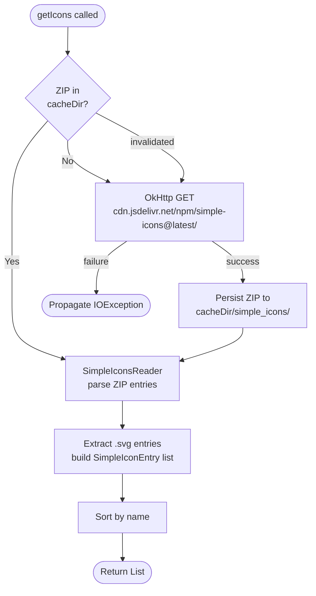

# `core:iconpack`

> Simple Icons integration — thousands of brand SVG logos, downloaded once and cached forever

## Overview

`core:iconpack` integrates the [Simple Icons](https://simpleicons.org/) open-source library to give every installed PWA access to a high-quality brand logo. The library ZIP is downloaded once from jsDelivr CDN, cached to the app's cache directory, and parsed into an in-memory list of `SimpleIconEntry` objects. Subsequent accesses are served entirely from disk.

- Namespace: `io.shellify.core.iconpack`
- Convention plugin: `shellify.android.library`

## Purpose

- Provide a large, recognisable icon set without bundling assets in the APK
- Keep the APK small by doing a one-time lazy download at first icon-picker use
- Enable offline icon browsing after the initial download
- Supply SVG strings to `core:shortcut` for high-resolution launcher icon rendering

## Key Classes / Files

| Class | Description |
|---|---|
| `SimpleIconsManager` | Main entry point. Downloads the Simple Icons ZIP from `cdn.jsdelivr.net/npm/simple-icons@latest/` on first access; caches the ZIP in `context.cacheDir/simple_icons/`; delegates to `SimpleIconsReader` for parsing; exposes `getIcons(): List<SimpleIconEntry>` and `getIconByName(name): SimpleIconEntry?`. |
| `SimpleIconsReader` | Reads the cached ZIP archive and extracts all `.svg` entries. Parses each entry into a `SimpleIconEntry`. Returns a sorted list of entries. |
| `SimpleIconEntry` | Data class: `name: String` (display name, e.g. `"YouTube"`), `slug: String` (file stem, e.g. `"youtube"`), `svgString: String` (raw SVG markup). |

### Download lifecycle

```
First access (no cache)  →  download ZIP from CDN  →  persist to cacheDir
Subsequent access        →  read directly from cacheDir
Cache invalidation       →  delete cacheDir/simple_icons/ and re-download
```

## Dependencies

```kotlin
// core/iconpack/build.gradle.kts
dependencies {
    api(project(":core:domain"))
    implementation("com.squareup.okhttp3:okhttp:<version>")
    implementation("org.jetbrains.kotlinx:kotlinx-coroutines-android:<version>")
}
```

## Usage

**Loading the icon list (first call triggers download if not cached):**

```kotlin
// Called from feature:add icon picker ViewModel
val icons: List<SimpleIconEntry> = simpleIconsManager.getIcons()
```

**Finding a specific icon by name:**

```kotlin
val youtubeIcon: SimpleIconEntry? = simpleIconsManager.getIconByName("YouTube")
youtubeIcon?.let { icon ->
    // Pass icon.svgString to SvgIconRenderer in core:shortcut
}
```

**Rendering the SVG to a Bitmap (delegated to core:shortcut):**

```kotlin
val bitmap: Bitmap = svgIconRenderer.render(icon.svgString, sizePx = 192)
```

**Forcing a re-download (e.g. user taps "Refresh icons"):**

```kotlin
simpleIconsManager.invalidateCache()
// Next call to getIcons() will trigger a fresh download
```

## Mermaid Diagram



## Configuration

| Item | Value / Notes |
|---|---|
| CDN URL | `https://cdn.jsdelivr.net/npm/simple-icons@latest/` |
| Cache location | `context.cacheDir/simple_icons/simple-icons.zip` |
| Library version pin | `@latest` (update by deleting cache and re-downloading) |
| Network requirement | Internet required for first download only |
| Offline support | Full offline access after initial download |
| SVG format | Raw SVG strings — no rasterisation until `SvgIconRenderer` is called |

**Consumers:** `feature:add` (icon picker screen), `feature:shortcuts` (icon display in shortcut list), `core:backup` (exports icon files), `core:shortcut` (SVG → Bitmap for launcher shortcut creation).
