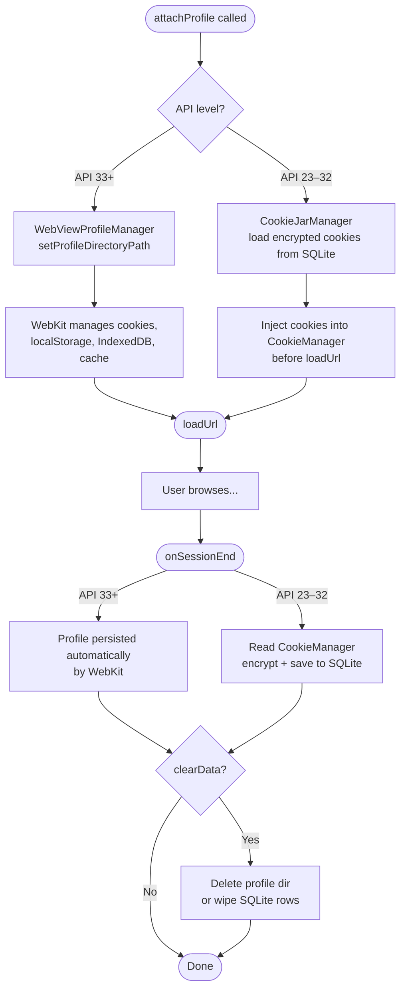

# `core:isolation`

> Per-app cookie and WebView profile isolation — each PWA lives in its own sandbox

## Overview

`core:isolation` ensures that every web app installed in Shellify is fully isolated from every other. Cookies, localStorage, IndexedDB, and the HTTP cache cannot leak between apps. The implementation strategy differs by API level: Android 13+ uses first-class WebView Profiles; older devices fall back to an encrypted per-app cookie jar.

- Namespace: `io.shellify.core.isolation`
- Convention plugin: `shellify.android.library`

## Purpose

- Prevent cross-app cookie and storage leakage
- Provide session save/restore so users resume exactly where they left off
- Enable one-tap "clear app data" scoped to a single web app
- Handle both modern (API 33+) and legacy (API 23–32) devices transparently

## Key Classes / Files

| Class | Description |
|---|---|
| `IsolationManager` | Central coordinator. Selects the isolation strategy at runtime based on the device API level and exposes a single, unified API for all callers. |
| `WebViewProfileManager` | Android 13+ only. Calls `WebView.setProfileDirectoryPath()` to assign a dedicated on-disk profile directory per `isolationId`. Cookies, localStorage, IndexedDB, and the HTTP cache are all scoped to that directory automatically by WebKit. |
| `CookieJarManager` | API 23–32 fallback. Encrypts cookies using `CryptoManager` (from `core:crypto`) and persists them to a per-`isolationId` SQLite table. Restores cookies before each page load and saves them after each session end. |

### IsolationManager API

```kotlin
// Must be called BEFORE adding the WebView to the view hierarchy
suspendFun attachProfile(webView: WebView, isolationId: String)

// Must be called BEFORE loadUrl — suspends on API < 33 while cookies are restored
suspend fun restoreSession(isolationId: String)

// Call when user navigates away or the activity pauses
suspend fun onSessionEnd(isolationId: String, visitedUrls: List<String>)

// Wipes the entire profile/cookie jar for this app
suspend fun clearData(isolationId: String)
```

**Call order is critical.** Violating the order leads to cookies belonging to the wrong app or to data loss:

```
attachProfile(webView, id) → restoreSession(id) → loadUrl(...) → onSessionEnd(id, urls)
```

## Dependencies

```kotlin
// core/isolation/build.gradle.kts
dependencies {
    api(project(":core:domain"))
    implementation(project(":core:crypto"))
    implementation(project(":core:engine"))
    implementation("androidx.webkit:webkit:<version>")
}
```

## Usage

**Typical usage inside a WebView host Fragment/Activity:**

```kotlin
// 1. Before attaching WebView to layout
isolationManager.attachProfile(webView, app.isolationId)

// 2. Before loading the start URL
isolationManager.restoreSession(app.isolationId)
webView.loadUrl(app.startUrl)

// 3. When leaving the screen
isolationManager.onSessionEnd(app.isolationId, webView.visitedUrls)

// 4. User-triggered "clear data" from settings
isolationManager.clearData(app.isolationId)
```

**Checking isolation strategy at runtime:**

```kotlin
val strategy = if (Build.VERSION.SDK_INT >= 33) "WebView Profile" else "Encrypted CookieJar"
```

## Mermaid Diagram



## Configuration

| Item | Notes |
|---|---|
| Minimum API for WebView Profiles | API 33 (Android 13) |
| Legacy fallback | API 23–32 via `CookieJarManager` |
| Cookie encryption | Delegated to `core:crypto` (`CryptoManager`) — Android Keystore-backed |
| SQLite table | One row per cookie per `isolationId` |
| `isolationId` format | UUID assigned at PWA creation time; stored in `core:domain` `WebApp` entity |

**Consumers:** `feature:webview` (attaches profiles and restores sessions), `feature:settings` (clear data action), `core:backup` (exports/imports cookie jars and WebView profiles).
