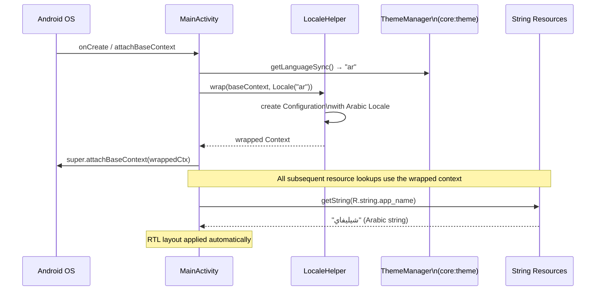

# `core:locale`

> Runtime language switching without app restart — wraps the app Context with the user's chosen Locale

## Overview

`core:locale` is a small, zero-dependency utility module that overrides the system locale for Shellify's Context chain at startup. By wrapping the `Context` in `MainActivity.attachBaseContext()`, every string resource resolution across all modules uses the user-selected language — without touching the device-wide locale and without requiring an app restart.

- Namespace: `io.shellify.core.locale`
- Convention plugin: `shellify.android.library`

## Purpose

- Provide runtime language switching for the three supported locales (English, French, Arabic)
- Change the UI language without restarting the app — `attachBaseContext` runs on every Activity creation
- Ensure RTL layout is applied automatically for Arabic via the wrapped Context
- Keep the implementation minimal — no external libraries needed

## Key Classes / Files

| Class | Description |
|---|---|
| `LocaleHelper` | Static utility (`object`). `wrap(context, locale)` creates a new `Configuration` with the requested `Locale`, applies it to a copy of the context's resources, and returns a new `ContextWrapper`. This wrapped context is returned from `attachBaseContext()` so the entire view hierarchy resolves strings in the chosen language. |

### `LocaleHelper` API

```kotlin
object LocaleHelper {
    /**
     * Returns a new Context that resolves all string resources in [locale].
     * Call this inside Activity.attachBaseContext() — before super().
     */
    fun wrap(context: Context, locale: Locale): Context
}
```

### Supported locales

| Code | Language | Direction |
|---|---|---|
| `en` | English | LTR |
| `fr` | French | LTR |
| `ar` | Arabic | RTL (automatic via `Locale` + Compose) |

## Dependencies

```kotlin
// core/locale/build.gradle.kts
dependencies {
    implementation("androidx.core:core-ktx:<version>")
    // No other external dependencies
}
```

## Usage

**Applying the locale in MainActivity:**

```kotlin
override fun attachBaseContext(newBase: Context) {
    // Read the stored language code synchronously (DataStore blocking read at startup)
    val languageCode: String = runBlocking {
        themeManager.getLanguageSync()   // returns "en", "fr", or "ar"
    }
    val locale = Locale(languageCode)
    super.attachBaseContext(LocaleHelper.wrap(newBase, locale))
}
```

**Triggering a language change at runtime:**

```kotlin
// From feature:settings or feature:onboarding
themeManager.setLanguage("ar")
// Activity is recreated (or user navigates back to trigger re-attach)
// attachBaseContext runs again and wraps with the new Locale
```

**Checking the active locale:**

```kotlin
val currentLocale: Locale = context.resources.configuration.locales[0]
```

## Mermaid Diagram



## Configuration

| Item | Notes |
|---|---|
| Module size | Minimal — one `object` class, one dependency |
| Locale application point | `MainActivity.attachBaseContext()` — covers the full Activity view hierarchy |
| RTL support | Automatic — Android applies RTL layout when `Locale` has RTL script |
| Language storage | Delegated to `core:theme` (`ThemeManager.selectedLanguage`) |
| Activity recreation | Required for a full layout refresh after language change; not required for text-only changes if the Context is re-wrapped |
| Minimum API | API 17+ for `createConfigurationContext()` (standard on all supported devices) |

**Consumers:** `app` (`MainActivity.attachBaseContext` is the sole call site), `core:theme` (stores the language preference that `LocaleHelper` reads).
