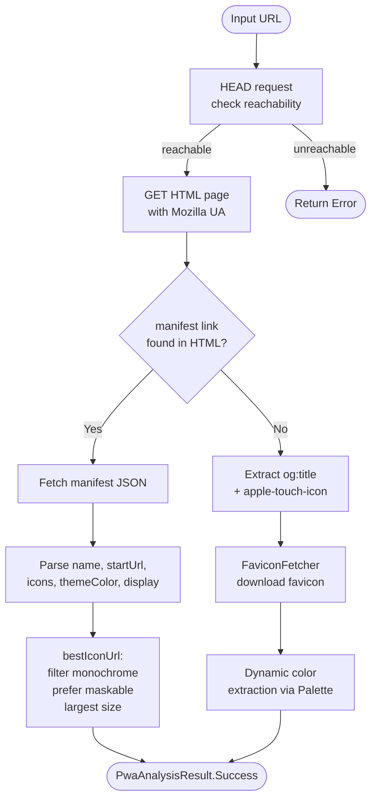

# `core:pwa`

> PWA manifest fetching, parsing, and smart icon selection for any web URL

## Overview

`core:pwa` is the intelligence layer that transforms a raw URL into a fully-described web app. It fetches the page HTML, extracts the W3C Web App Manifest link, downloads and parses the manifest JSON, and applies a priority-ordered icon selection algorithm to find the best icon. When no manifest is present, it falls back to Open Graph tags and favicons.

- Namespace: `io.shellify.core.pwa`
- Convention plugin: `shellify.android.library`

## Purpose

- Automate PWA metadata discovery so users only have to paste a URL
- Select the highest-quality icon automatically (maskable → largest → any)
- Extract theme and background colors to drive Material You theming
- Provide a favicon + dynamic color path for sites without a manifest

## Key Classes / Files

| Class | Description |
|---|---|
| `PwaAnalyzer` | Main entry point. Orchestrates the full fetch-parse-select pipeline. Uses the Mozilla user-agent string for compatibility with sites that serve richer manifests to non-Chrome browsers. |
| `PwaManifest` | Data class holding the parsed manifest fields: `name`, `shortName`, `startUrl`, `icons: List<PwaIcon>`, `themeColor`, `backgroundColor`, `display`. Includes `bestIconUrl()`. |
| `FaviconFetcher` | Downloads the site favicon as a `Bitmap` and runs dynamic color extraction (via Material You's `Palette`) to propose a `themeColor` when none is declared in the manifest. |

### `PwaManifest.bestIconUrl()` selection algorithm

1. Filter out icons whose `purpose` is `monochrome` only
2. Prefer icons with `purpose` containing `maskable`
3. Among remaining candidates, select the largest by declared pixel size
4. If no size is declared, fall back to any icon
5. Final fallback: the first icon in the original list

### Fallback chain when no manifest is found

| Priority | Source |
|---|---|
| 1 | `<link rel="manifest">` → manifest JSON |
| 2 | `<meta property="og:title">` + `<link rel="apple-touch-icon">` |
| 3 | `/favicon.ico` via `FaviconFetcher` |

## Dependencies

```kotlin
// core/pwa/build.gradle.kts
dependencies {
    api(project(":core:domain"))
    implementation("com.squareup.okhttp3:okhttp:<version>")
    implementation("com.google.code.gson:gson:<version>")
}
```

## Usage

**Analyzing a URL before adding a PWA:**

```kotlin
val result: PwaAnalysisResult = pwaAnalyzer.analyze("https://example.com")

when (result) {
    is PwaAnalysisResult.Success -> {
        val manifest = result.manifest
        println("Name: ${manifest.name}")
        println("Icon: ${manifest.bestIconUrl()}")
        println("Theme: ${manifest.themeColor}")
    }
    is PwaAnalysisResult.NoManifest -> {
        // Fallback metadata available in result.fallback
    }
    is PwaAnalysisResult.Error -> showError(result.message)
}
```

**Adding a custom icon override (bypasses bestIconUrl):**

```kotlin
// Pass a user-selected SimpleIconEntry from core:iconpack instead
val iconUrl = simpleIconEntry.svgString
```

## Mermaid Diagram



## Configuration

| Item | Notes |
|---|---|
| User-agent for fetch | Mozilla/5.0 compatible string (set in `PwaAnalyzer`) |
| Manifest field parsing | Gson; unknown fields are silently ignored |
| Icon size parsing | Parses `"192x192"` WxH strings; falls back to 0 if unparseable |
| `display` modes supported | `standalone`, `fullscreen`, `minimal-ui`, `browser` |
| Network timeout | Inherits OkHttp default (10 s connect, 10 s read) |

**Consumers:** `feature:add` (URL analysis on the add screen), `feature:home` (icon display in the app grid), `feature:shortcuts` (shortcut icon rendering).
