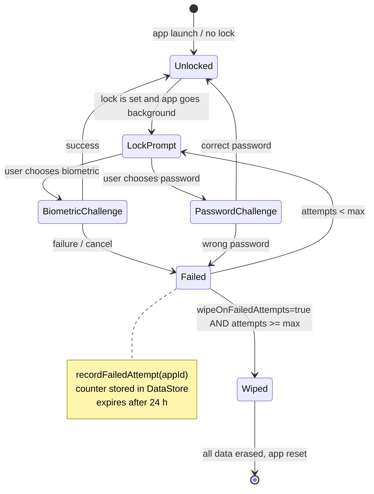

# core:security

> Password management, biometric authentication, and per-app lock state — Shellify's access-control layer

## Overview

`core:security` enforces the lock mechanisms that protect individual web apps and the global app vault. It combines PBKDF2 password hashing, Android Biometric, and DataStore persistence to provide a durable, process-death-safe lock state without ever storing a plaintext password.

- Convention plugin: `shellify.android.library`
- Namespace: `io.shellify.core.security`

## Purpose

Centralise all authentication logic so that:

- Passwords are hashed before storage and never appear in plaintext anywhere.
- Failed attempt counters survive process death (DataStore) and expire automatically after 24 hours.
- Biometric auth is abstracted behind a single helper that features can call without knowing AndroidX Biometric internals.
- Screen-capture protection and wipe-on-failure flags are observable by the UI layer without tight coupling.

## Key Classes / Files

### `PasswordManager`

DataStore-backed manager for all password and security preferences.

| Property / Method | Description |
|---|---|
| `passwordHash: Flow<String?>` | Global app password as a PBKDF2-SHA1 hash; `null` means no password is set |
| `screenshotProtection: Flow<Boolean>` | When `true`, `MainActivity` applies `FLAG_SECURE` to prevent screen capture |
| `wipeOnFailedAttempts: Flow<Boolean>` | When `true`, all app data is wiped after the maximum failed-attempt threshold |
| `setPassword(raw: String)` | Hashes the raw password via `PasswordUtils` and persists the hash |
| `clearPassword()` | Removes the stored hash (disables global lock) |
| `recordFailedAttempt(appId: String)` | Increments the per-app counter; counter expires after 24 hours |
| `reloadFromFile()` | Forces a DataStore refresh — called after a backup restore to pick up imported settings |

### `BiometricHelper`

Thin wrapper around `androidx.biometric.BiometricPrompt`.

- Builds a `BiometricPrompt` with the caller's `FragmentActivity`.
- Supports fingerprint and face unlock (Class 2 / Class 3 biometrics).
- Callbacks map to a simple `onSuccess` / `onFailure` / `onCancel` interface.

### `PasswordUtils`

PBKDF2-SHA1 hashing utilities.

- `hash(password: String, salt: ByteArray): String` — 10 000 iterations, 256-bit output, Base64-encoded.
- `verify(raw: String, stored: String): Boolean` — constant-time comparison.
- Salt is generated fresh per password set operation and stored alongside the hash.

### `Base64Codec`

Testable wrapper around `android.util.Base64`. Injected wherever Base64 encoding is needed, allowing unit tests to run without Robolectric by substituting a pure-JVM implementation.

## Dependencies

```kotlin
// build.gradle.kts (core:security)
dependencies {
    implementation(project(":core:domain"))
    implementation(project(":core:crypto"))

    implementation(libs.androidx.biometric)
    implementation(libs.androidx.datastore.preferences)
    implementation(libs.androidx.core.ktx)
}
```

## Usage

### Checking and verifying a password

```kotlin
@Inject lateinit var passwordManager: PasswordManager

// Collect the current hash
passwordManager.passwordHash.collect { hash ->
    if (hash == null) { /* no lock set */ }
}

// Set a new password
passwordManager.setPassword("my-secret")

// Verify on unlock
val ok = PasswordUtils.verify(inputFromUser, storedHash)
if (!ok) passwordManager.recordFailedAttempt(appId)
```

### Launching biometric prompt

```kotlin
@Inject lateinit var biometricHelper: BiometricHelper

biometricHelper.authenticate(
    activity = this,
    title = "Unlock app",
    onSuccess = { /* open the web app */ },
    onFailure = { /* show error */ },
    onCancel = { /* dismiss */ }
)
```

### Observing screenshot protection in MainActivity

```kotlin
lifecycleScope.launch {
    passwordManager.screenshotProtection.collect { enabled ->
        if (enabled) window.addFlags(WindowManager.LayoutParams.FLAG_SECURE)
        else window.clearFlags(WindowManager.LayoutParams.FLAG_SECURE)
    }
}
```

## Mermaid Diagram



## Configuration

| DataStore key | Type | Default | Description |
|---|---|---|---|
| `password_hash` | `String` | `""` (none) | PBKDF2-SHA1 hash of the global password |
| `screenshot_protection` | `Boolean` | `false` | Enables `FLAG_SECURE` in `MainActivity` |
| `wipe_on_failed_attempts` | `Boolean` | `false` | Wipe all data after max failed attempts |
| `failed_attempts_{appId}` | `String` (JSON) | `""` | Per-app counter with ISO-8601 timestamp for 24 h expiry |

All keys are defined as typed `Preferences.Key<*>` constants in `SecurityPreferences.kt`. DataStore writes are performed on the IO dispatcher; reads are exposed as `Flow` for Compose collection.
