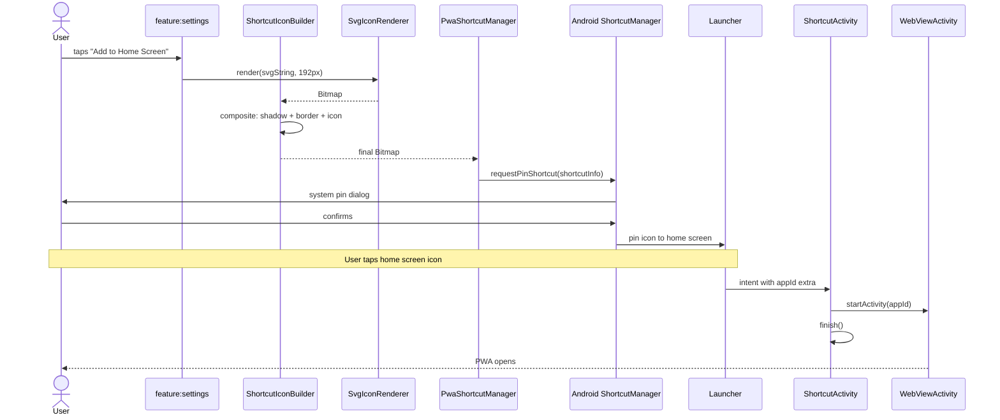

# `core:shortcut`

> Android launcher shortcut creation — pin any installed PWA to the home screen as a first-class icon

## Overview

`core:shortcut` handles everything needed to place a tappable launcher icon for a Shellify PWA on the device home screen. It renders the app's icon (SVG or bitmap) into a launcher-ready `Bitmap` with shadow and border, then uses `ShortcutManager.requestPinShortcut()` to trigger the system pin dialog. Tapping the resulting icon opens `ShortcutActivity`, which resolves the app and launches it directly in `WebViewActivity`.

- Namespace: `io.shellify.core.shortcut`
- Convention plugin: `shellify.android.library`

## Purpose

- Let users access any installed PWA directly from their home screen
- Bridge the gap between Shellify's internal app list and the Android launcher
- Render crisp, high-resolution icons from SVG source without bundling PNGs
- Manage the list of pinned shortcuts (add, remove, update icon)

## Key Classes / Files

| Class | Description |
|---|---|
| `PwaShortcutManager` | Central coordinator. Must be initialised with `init(ShortcutActivity::class.java)` before use. `createShortcut(webApp, bitmap)` calls `ShortcutManager.requestPinShortcut()` and passes the app's `id` as the shortcut intent extra. `removeShortcut(appId)` disables the pinned shortcut via `ShortcutManager.disableShortcuts()`. |
| `ShortcutIconBuilder` | Composites the final launcher icon. Takes either an SVG string or a downloaded bitmap, renders it centred on a rounded-square canvas, adds a configurable drop shadow, and optionally draws a border ring. Returns a `Bitmap` sized for the current display density. |
| `SvgIconRenderer` | Converts a raw SVG string to a `Bitmap` using Android's `Canvas` + `Picture` APIs via a `WebView` offscreen render pass. Returns a hardware-accelerated `Bitmap`. |
| `ShortcutActivity` | Declared in the app manifest. Receives the launcher tap intent, reads the `appId` extra, and starts `WebViewActivity` with the correct app. Finishes immediately — no UI is shown. |

### Required manifest declaration

```xml
<!-- In app/src/main/AndroidManifest.xml -->
<activity
    android:name="io.shellify.core.shortcut.ShortcutActivity"
    android:exported="true"
    android:launchMode="singleTask">
    <intent-filter>
        <action android:name="android.intent.action.MAIN" />
    </intent-filter>
</activity>

<uses-permission android:name="com.android.launcher.permission.INSTALL_SHORTCUT" />
```

## Dependencies

```kotlin
// core/shortcut/build.gradle.kts
dependencies {
    api(project(":core:domain"))
    implementation("io.coil-kt:coil:<version>")
}
```

## Usage

**Initialising the manager (once, in Application.onCreate or DI module):**

```kotlin
pwaShortcutManager.init(ShortcutActivity::class.java)
```

**Creating a pinned shortcut:**

```kotlin
// 1. Build the icon bitmap
val icon: Bitmap = shortcutIconBuilder.build(
    svgString = selectedIcon.svgString,   // or pass a downloaded bitmap
    sizePx    = 192,
    addShadow = true
)

// 2. Request the pin — system shows a confirmation dialog to the user
pwaShortcutManager.createShortcut(webApp = app, bitmap = icon)
```

**Removing a shortcut:**

```kotlin
pwaShortcutManager.removeShortcut(appId = app.id)
```

**Converting SVG to Bitmap independently:**

```kotlin
val bitmap: Bitmap = svgIconRenderer.render(svgString, sizePx = 192)
```

## Mermaid Diagram



## Configuration

| Item | Notes |
|---|---|
| Minimum API | API 26 (Android 8) for `ShortcutManager.requestPinShortcut()` |
| Permission | `com.android.launcher.permission.INSTALL_SHORTCUT` |
| Icon size | 192 × 192 px (adaptive icon safe zone respected) |
| Shadow | Drop shadow applied by `ShortcutIconBuilder`; radius configurable |
| SVG rendering | Offscreen WebView pass via `SvgIconRenderer`; result is hardware bitmap |
| Launcher support | Any launcher supporting pinned shortcuts (API 26+ standard) |

**Consumers:** `feature:settings` (shortcut creation button), `feature:shortcuts` (manage pinned shortcuts list).
