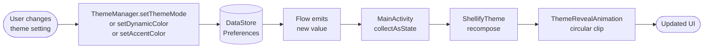

# `core:theme`

> DataStore-backed theme and global app preferences — dark mode, Material You, accent color, language

## Overview

`core:theme` manages every user-facing global preference in Shellify: light/dark/system theme mode, Material You dynamic color, a custom accent color override, and the selected UI language. All preferences are persisted in Jetpack DataStore and exposed as `Flow`s so the UI reacts immediately to any change. A `ThemeRevealAnimation` Composable provides the circular reveal transition recommended by the Material motion spec.

- Namespace: `io.shellify.core.theme`
- Convention plugin: `shellify.android.library` + `shellify.compose`

## Purpose

- Provide a single source of truth for all theme and locale preferences
- Drive `ShellifyTheme` recomposition reactively via `StateFlow`/`collectAsState()`
- Support Material You wallpaper-based color extraction and custom accent override
- Store language preference so `core:locale` can apply it at context creation time

## Key Classes / Files

| Class | Description |
|---|---|
| `ThemeManager` | Central DataStore wrapper. Exposes all preference flows and setter methods. |
| `ThemeMode` | Enum: `SYSTEM`, `LIGHT`, `DARK`. `SYSTEM` defers to the OS dark-mode setting. |
| `ThemeRevealAnimation` | Composable that animates a circular clip expanding from the tapped point when the theme changes. Implements the Material motion circular reveal spec. |

### `ThemeManager` API

```kotlin
// Flows — collect in MainActivity or a top-level ViewModel
val themeMode: Flow<ThemeMode>
val dynamicColor: Flow<Boolean>      // Material You — wallpaper-based colors
val accentColor: Flow<Color?>        // null = use dynamicColor or default palette
val selectedLanguage: Flow<String>   // "en" | "fr" | "ar"

// Setters — each writes to DataStore and emits on the corresponding Flow
suspend fun setThemeMode(mode: ThemeMode)
suspend fun setDynamicColor(enabled: Boolean)
suspend fun setAccentColor(color: Color?)
suspend fun setLanguage(languageCode: String)
```

### Color priority

```
accentColor set  →  use custom accent (overrides dynamic color)
accentColor null + dynamicColor = true  →  use wallpaper-derived Material You scheme
accentColor null + dynamicColor = false →  use default Shellify color palette
```

## Dependencies

```kotlin
// core/theme/build.gradle.kts
dependencies {
    api(project(":core:domain"))
    implementation("androidx.datastore:datastore-preferences:<version>")
    implementation(platform("androidx.compose:compose-bom:2024.12.01"))
    implementation("androidx.compose.material3:material3")
}
```

## Usage

**Reading theme in MainActivity:**

```kotlin
val themeMode by themeManager.themeMode.collectAsState(initial = ThemeMode.SYSTEM)
val dynamicColor by themeManager.dynamicColor.collectAsState(initial = true)
val accentColor by themeManager.accentColor.collectAsState(initial = null)

ShellifyTheme(
    themeMode    = themeMode,
    dynamicColor = dynamicColor,
    accentColor  = accentColor
) {
    // app content
}
```

**Changing theme from settings:**

```kotlin
// User picks Dark mode
themeManager.setThemeMode(ThemeMode.DARK)

// User picks a custom purple accent
themeManager.setAccentColor(Color(0xFF6650A4))

// User disables Material You
themeManager.setDynamicColor(false)
```

**Using the reveal animation:**

```kotlin
ThemeRevealAnimation(
    visible  = showReveal,
    origin   = tapOffset,
    content  = { /* new-theme content */ }
)
```

## Mermaid Diagram



## Configuration

| Item | Value / Notes |
|---|---|
| Persistence layer | `androidx.datastore:datastore-preferences` |
| DataStore file | `theme_prefs.preferences_pb` in app's `filesDir` |
| Theme modes | `SYSTEM`, `LIGHT`, `DARK` |
| Supported languages | `en`, `fr`, `ar` (RTL handled by Compose automatically) |
| Material You | Requires API 31+ for wallpaper color extraction |
| Compose BOM | `2024.12.01` |
| Reveal animation | Circular clip; origin = tap coordinates passed from the toggle widget |

**Consumers:** `app` (`MainActivity` applies `ShellifyTheme`), `feature:settings` (global settings screen renders all toggles), `feature:onboarding` (language and theme selection steps), `core:backup` (exports and imports `theme.json`), `core:locale` (reads `selectedLanguage` to configure the Context locale).
