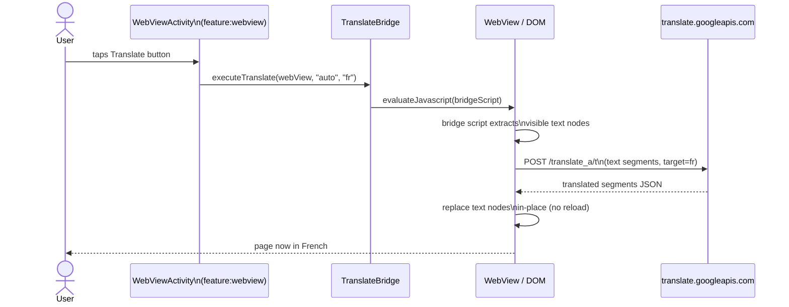

# `core:translate`

> In-page translation via JavaScript injection — no page reload, no browser UI chrome

## Overview

`core:translate` injects a thin JavaScript bridge into any WebView to translate the visible page content in-place. It hooks the Google Translate API (`translate.googleapis.com`) so text nodes are replaced without reloading the page or navigating away. Translation is configurable per installed PWA.

- Namespace: `io.shellify.core.translate`
- Convention plugin: `shellify.android.library`

## Purpose

- Let users read foreign-language websites in their preferred language
- Provide translation without leaving the app or showing browser toolbar UI
- Keep translation settings per-app (each PWA has its own `translationConfig`)
- Support 16 target languages covering the majority of Shellify's user base

## Key Classes / Files

| Class | Description |
|---|---|
| `TranslateBridge` | Core class. Builds a JavaScript snippet and calls `WebView.evaluateJavascript()` to inject it. Hooks `translate.googleapis.com` to intercept and process translation responses. Modifies the page DOM in-place — no navigation or reload triggered. |

### `TranslateBridge` API

```kotlin
// Inject the bridge and trigger translation
fun executeTranslate(
    webView: WebView,
    sourceLanguage: String,  // "auto" for auto-detect, or ISO 639-1 code
    targetLanguage: String   // ISO 639-1 code, e.g. "fr", "ar"
)

// Remove translation and restore original text
fun revertTranslation(webView: WebView)
```

### Supported target languages

| Code | Language | Code | Language |
|---|---|---|---|
| `en` | English | `ar` | Arabic |
| `zh` | Chinese | `ja` | Japanese |
| `es` | Spanish | `ko` | Korean |
| `fr` | French | `pt` | Portuguese |
| `de` | German | `ru` | Russian |
| `it` | Italian | `nl` | Dutch |
| `pl` | Polish | `tr` | Turkish |
| `hi` | Hindi | `vi` | Vietnamese |

### Per-app translation config

Translation settings are stored on the `WebApp.translationConfig` domain object:

```kotlin
data class TranslationConfig(
    val enabled: Boolean,
    val sourceLanguage: String,   // "auto" by default
    val targetLanguage: String    // user-selected
)
```

## Dependencies

```kotlin
// core/translate/build.gradle.kts
dependencies {
    api(project(":core:domain"))
    implementation("com.squareup.okhttp3:okhttp:<version>")
    implementation("com.google.code.gson:gson:<version>")
}
```

## Usage

**Triggering translation from the WebView host:**

```kotlin
// Called when user taps the translate FAB
if (app.translationConfig.enabled) {
    translateBridge.executeTranslate(
        webView       = binding.webView,
        sourceLanguage = app.translationConfig.sourceLanguage,
        targetLanguage = app.translationConfig.targetLanguage
    )
}
```

**Reverting to the original page language:**

```kotlin
translateBridge.revertTranslation(binding.webView)
```

**Enabling translation for a PWA:**

```kotlin
// From feature:settings or feature:translate language picker
webAppRepository.updateTranslationConfig(
    appId  = app.id,
    config = TranslationConfig(enabled = true, sourceLanguage = "auto", targetLanguage = "fr")
)
```

## Mermaid Diagram



## Configuration

| Item | Notes |
|---|---|
| Translation API | `translate.googleapis.com/translate_a/t` (no API key required for JS bridge approach) |
| Source language | `"auto"` uses Google's language detection |
| Per-app storage | `WebApp.translationConfig` in `core:domain` / `core:database` |
| DOM mutation strategy | Text node replacement; does not affect layout or media |
| Network | Requires internet; no offline fallback |

**Consumers:** `feature:webview` (injects bridge when translation is enabled for the current app), `feature:translate` (language selector UI), `feature:settings` (translate on/off toggle per app).
