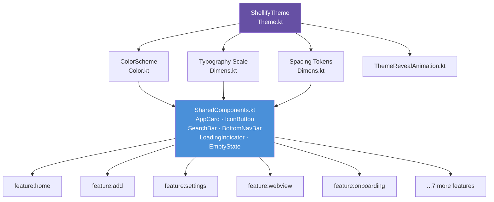

# `core:ui`

> Shared Compose design system — tokens, components, and Material 3 theme for every screen in Shellify

## Overview

`core:ui` is the single design system consumed by all feature modules and the `app` shell. It provides the `ShellifyTheme` Composable (Material 3 with dynamic color and custom accent support), all design tokens (colors, spacing, typography), a library of shared Composables, and the canonical `strings.xml` from which all modules inherit their string resources.

- Namespace: `io.shellify.core.ui` / `io.shellify.app.presentation`
- Convention plugin: `shellify.android.library` + `shellify.compose`

## Purpose

- Enforce visual consistency across all 10 feature modules and the app shell
- Centralise design tokens so a single change propagates everywhere
- Reduce boilerplate in feature modules — no `MaterialTheme` setup needed
- Own the canonical English strings so feature modules only declare their own unique strings

## Key Files

| File | Description |
|---|---|
| `Theme.kt` | `ShellifyTheme` Composable. Selects `ColorScheme` based on `ThemeMode` (SYSTEM/LIGHT/DARK); applies Material You dynamic color when enabled; overrides with custom `accentColor` when set. Passes the resolved `ColorScheme` to `MaterialTheme`. |
| `Color.kt` | Light and dark `ColorScheme` seed colors plus semantic aliases (e.g. `SurfaceError`, `OnSurfaceSubtle`). |
| `Dimens.kt` | Spacing tokens: `4.dp`, `8.dp`, `12.dp`, `16.dp`, `20.dp`, `24.dp`; icon sizes; corner radii. Typography scale definitions. |
| `SharedComponents.kt` | Reusable Composables: `AppCard`, `IconButton`, `SearchBar`, `BottomNavBar`, `LoadingIndicator`, `EmptyState`. |
| `ThemeMode.kt` | `ThemeMode` enum (`SYSTEM`, `LIGHT`, `DARK`) — shared between `core:ui` and `core:theme` to avoid circular dependency. |
| `ThemeRevealAnimation.kt` | Circular reveal clip Composable for animated theme transitions (Material motion spec). |
| `res/values/strings.xml` | Canonical English string resources. All feature modules inherit this via the module dependency; they only declare strings unique to their feature. |
| `res/drawable/ic_app_logo_fg.xml` | App logo foreground vector (white + violet shapes) — used in the `HomeScreen` TopAppBar with a circular primary-color background to match the launcher icon appearance. |

### Shared component catalogue

| Component | Props |
|---|---|
| `AppCard` | `webApp`, `onClick`, `onLongClick` — renders icon + name + domain |
| `IconButton` | `icon`, `contentDescription`, `onClick`, `enabled` |
| `SearchBar` | `query`, `onQueryChange`, `placeholder` |
| `BottomNavBar` | `currentRoute`, `onNavigate` — 4-tab navigation rail |
| `LoadingIndicator` | `modifier` — centered `CircularProgressIndicator` |
| `EmptyState` | `title`, `body`, `illustration`, `action` |

## Dependencies

```kotlin
// core/ui/build.gradle.kts
dependencies {
    api(project(":core:domain"))
    api(project(":core:iconpack"))
    implementation(platform("androidx.compose:compose-bom:2024.12.01"))
    implementation("androidx.compose.material3:material3")
    implementation("androidx.compose.ui:ui")
    implementation("androidx.compose.ui:ui-tooling-preview")
    implementation("io.coil-kt:coil-compose:2.7.0")
}
```

## Usage

**Wrapping the app with the design system (in MainActivity):**

```kotlin
ShellifyTheme(
    themeMode    = themeMode,
    dynamicColor = dynamicColor,
    accentColor  = accentColor
) {
    ShellifyNavHost(navController)
}
```

**Using design tokens in a feature module:**

```kotlin
// Spacing
Modifier.padding(Dimens.SpacingMedium)   // 16.dp

// Color semantic alias
Box(modifier = Modifier.background(MaterialTheme.colorScheme.surfaceVariant))
```

**Using a shared component:**

```kotlin
AppCard(
    webApp      = app,
    onClick     = { navController.navigate(WebViewRoute(app.id)) },
    onLongClick = { showContextMenu(app) }
)
```

**Rendering a remote icon with Coil:**

```kotlin
AsyncImage(
    model             = app.iconUrl,
    contentDescription = app.name,
    modifier          = Modifier.size(Dimens.IconSizeLarge)
)
```

## Mermaid Diagram



## Configuration

| Item | Value / Notes |
|---|---|
| Compose BOM | `2024.12.01` |
| Material version | Material 3 (M3) |
| Image loading | Coil `2.7.0` (`coil-compose`) |
| Spacing scale | 4, 8, 12, 16, 20, 24 dp |
| Dynamic color API | Requires API 31+ (`DynamicColors.applyToMaterialTheme`) |
| RTL support | Automatic via Compose `LocalLayoutDirection` |
| String ownership | `res/values/strings.xml` in this module — feature modules inherit and may add their own |
| Preview support | `ui-tooling-preview` included for `@Preview` in feature modules |

**Consumers:** All 10 feature modules (`feature:home`, `feature:add`, `feature:settings`, `feature:webview`, `feature:onboarding`, `feature:shortcuts`, `feature:share`, `feature:translate`, `feature:notifications`, `feature:search`) and the `app` shell module.
