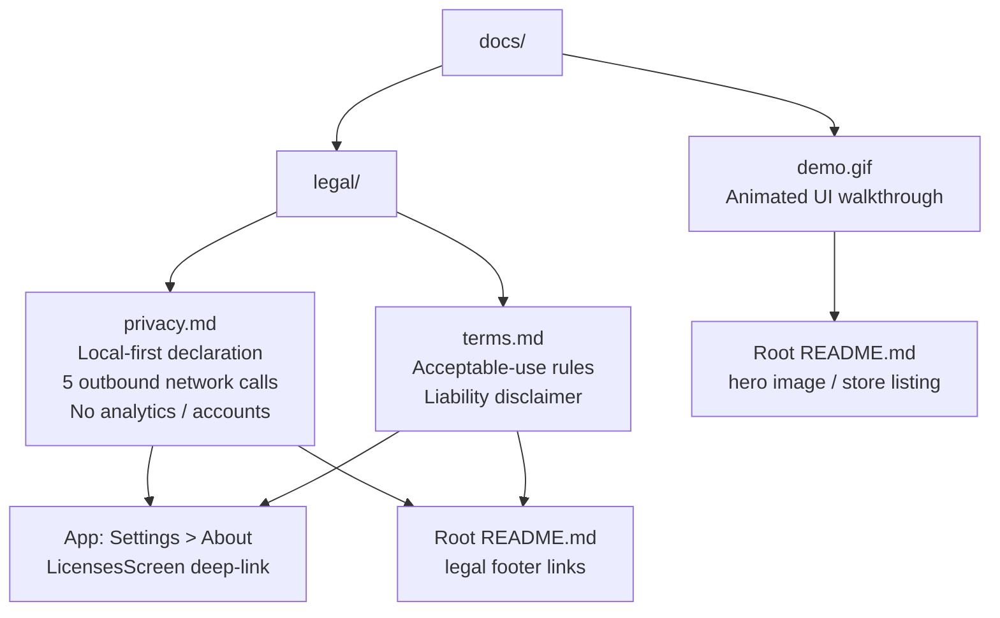

# docs

> Static assets and legal documents — the demo animation for the store listing and the legally binding privacy policy and terms of service.

## Overview

The `docs/` directory holds non-code assets that are referenced from the root `README.md`, from the Google Play / F-Droid store listing, and from the in-app Settings > About screen.

Key files:

- `demo.gif` — Animated walkthrough of the Shellify UI; embedded in the root `README.md` as the hero image; used in store listings and marketing materials
- `legal/privacy.md` — Privacy policy; describes Shellify's local-first data handling, lists every outbound network call, and declares that no personal data is collected or transmitted to Shellify-owned infrastructure
- `legal/terms.md` — Terms of service; acceptable-use rules and liability disclaimers

## Purpose

Keeping legal documents in version control alongside source code means:

1. Every change to the privacy policy or terms is tracked in git with a commit message and author — providing an audit trail.
2. The documents are always in sync with the code that implements the described behaviour (e.g., when a new network call is added, the developer updates `privacy.md` in the same PR).
3. The in-app `LicensesScreen` (Settings > About) deep-links to these files by their canonical URL, so the app never needs to bundle a copy separately.

The privacy policy is particularly important because Shellify explicitly makes a **local-first** promise: no backend, no accounts, no analytics. The document lists every exception to that rule with precision.

## Usage

### Updating the privacy policy or terms

Edit the relevant Markdown file directly:

```bash
# Open in your editor
$EDITOR docs/legal/privacy.md
```

Commit the change with a message that explains *what* changed and *why* (e.g., "privacy: add Simple Icons CDN to network request table"). The root `README.md` and the in-app About screen link to the canonical file on the default branch — no other files need updating.

### Updating the demo GIF

Replace `docs/demo.gif` with the new recording. Keep the filename identical so all existing references continue to work. Recommended recording settings: device frame visible, 30 fps, < 5 MB, 1080p or lower.

### Referencing legal docs from code

The `LicensesScreen` composable in `:feature:settings` opens these files via an in-app WebView pointed at their raw GitHub URL. If the repository URL changes, update that constant in the feature module — the files themselves do not need to move.

## Dependencies

`docs/` has no build-time dependencies. It is not referenced by any `build.gradle.kts` file. References to `docs/` content:

| Reference | Location |
|---|---|
| `demo.gif` embed | Root `README.md` |
| `privacy.md` URL | `LicensesScreen.kt` in `:feature:settings` |
| `terms.md` URL | `LicensesScreen.kt` in `:feature:settings` |
| Both legal docs | Root `README.md` footer links |

## Mermaid Diagram



## Configuration

No build configuration is required for this directory. All files are plain Markdown or GIF assets served statically via the git repository.

### Network calls documented in privacy.md

The privacy policy lists exactly six outbound destinations the app may contact. Any new network call added to the codebase must be added to the table in `privacy.md` in the same pull request:

| Purpose | Destination |
|---|---|
| Fetch app icon | Chosen domain + `google.com/s2/favicons` (fallback) |
| Detect PWA manifest | Chosen domain |
| Download icon library | `cdn.jsdelivr.net` (Simple Icons) |
| Download Gecko engine (user-initiated) | `maven.mozilla.org` |
| In-page translation (if enabled by user) | `translate.googleapis.com` |
| Web content | Any site the user opens (governed by that site) |
