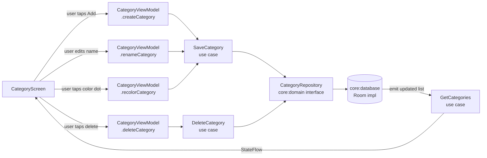

# `feature:category`

> Create, color-code, and organize your PWAs into named categories.

## Overview

`feature:category` provides a self-contained CRUD screen for managing `Category` entities. Categories created here surface as filter chips on `feature:home` and as an assignment dropdown on `feature:add`. The module has no awareness of those consumers — it only talks to `core:domain` use cases.

## Purpose

- List all existing categories with their names and colors.
- Allow inline name editing and per-category color selection.
- Create new categories and delete empty or non-empty ones (with confirmation).
- Assign or reassign apps to categories (via `UpdateWebAppCategory` use case).

## Key Classes / Files

### `CategoryViewModel`

```kotlin
class CategoryViewModel(
    private val getCategories: GetCategories,
    private val saveCategory: SaveCategory,
    private val deleteCategory: DeleteCategory,
) : ViewModel()
```

| Responsibility | Detail |
|---|---|
| Category list | `StateFlow<List<Category>>` collected from `GetCategories` |
| Create | `createCategory(name, color)` → `SaveCategory(Category(id=null, name, color))` |
| Rename | `renameCategory(id, newName)` → `SaveCategory` with updated name |
| Recolor | `recolorCategory(id, color)` → `SaveCategory` with updated color |
| Delete | `deleteCategory(id)` → `DeleteCategory(id)`; triggers confirmation dialog when category has apps |
| Edit state | `editingCategoryId: StateFlow<String?>` — which row is in inline-edit mode |

### `CategoryScreen`

```kotlin
@Composable
fun CategoryScreen(
    viewModel: CategoryViewModel,
    onNavigateBack: () -> Unit,
)
```

| UI element | Behaviour |
|---|---|
| Category list | `LazyColumn` of `CategoryRow` items |
| `CategoryRow` | Shows color dot, name (editable via `BasicTextField` when selected), delete icon |
| Inline edit | Tap name → enters edit mode (`editingCategoryId` set); tap elsewhere or Done → commits |
| Color picker | Tapping color dot opens `ColorPickerDialog` from `core:ui` |
| Add button | `FloatingActionButton` or top-bar icon → creates a new category with a default name |
| Delete confirmation | `AlertDialog` when the category being deleted contains apps |

## Dependencies

```kotlin
// feature/category/build.gradle.kts
dependencies {
    implementation(project(":core:domain"))
    implementation(project(":core:ui"))
}
```

`feature:category` has intentionally minimal dependencies — no engine, no network, no icon pack.

## Usage / How to navigate here

Reached from the global settings screen or from the category chip area on `HomeScreen` ("Manage categories" action):

```kotlin
// app NavGraph
composable("category") {
    CategoryScreen(
        viewModel = viewModel(),
        onNavigateBack = { navController.popBackStack() },
    )
}
```

## Mermaid Diagram



## Configuration

- **Category color palette**: the `ColorPickerDialog` in `core:ui` exposes a fixed palette of 16 Material-harmonized colors. No free-form hex input is provided by default — extend the palette in `core:ui` if needed.
- **Deletion policy**: deleting a category does **not** delete the apps assigned to it. Apps are moved to the "Uncategorized" bucket (null `categoryId`) by `DeleteCategory`'s implementation in `core:database`.
- **Ordering**: categories are displayed in insertion order. Drag-to-reorder is not currently implemented; add an `order` field to `Category` and a `ReorderCategories` use case if needed.
