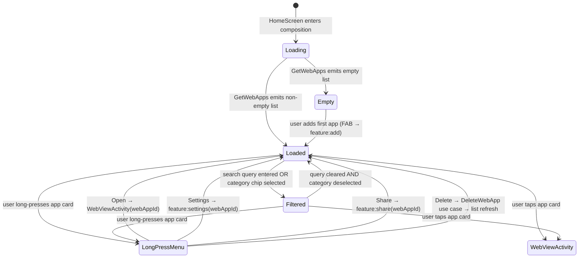

# `feature:home`

> The app grid — your installed PWAs at a glance, with search and category filtering.

## Overview

`feature:home` is the main landing screen of Shellify. It displays all saved `WebApp` entries in a lazy grid, provides a search bar and category filter chips, and acts as the primary navigation hub for reaching every other feature.

## Purpose

- Render the full list of installed PWAs using Coil + SVG icon loading.
- Let users filter by name (search bar) or by category (chip row).
- Surface quick-pick suggestions based on recently visited apps.
- Expose per-app actions (open, share, settings/edit, delete) via a long-press context menu.
- Provide an entry point to `feature:add` via a floating action button.

## Key Classes / Files

### `HomeViewModel`

```kotlin
class HomeViewModel(
    private val getWebApps: GetWebApps,
    private val deleteWebApp: DeleteWebApp,
) : ViewModel()
```

| Responsibility | Detail |
|---|---|
| App list state | `StateFlow<List<WebApp>>` collected from `GetWebApps` use case |
| Search | Filters list by `webApp.name.contains(query, ignoreCase = true)` |
| Category filter | Filters list by selected `categoryId`; `null` = show all |
| Quick-pick suggestions | Derived list sorted by `lastVisitedAt` descending, capped at 5 |
| Long-press actions | Exposes `onDelete(webApp)`, `onOpenSettings(webApp)`, `onShare(webApp)` |

### `HomeScreen`

Top-level Composable wired to `HomeViewModel` via `viewModel()` factory.

| UI element | Behaviour |
|---|---|
| Search bar | `OutlinedTextField` at top; updates `viewModel.searchQuery` |
| Category chips | `LazyRow` of `FilterChip`; selecting one updates `viewModel.selectedCategory` |
| App grid | `LazyVerticalGrid` of `WebAppCard` composables; icons loaded via `AsyncImage` (Coil) |
| FAB | Bottom-right; calls `navController.navigate("add")` |
| Empty state | When list is empty and no search active: CTA card that routes to `feature:onboarding` step 4 |
| Long-press menu | `DropdownMenu` with: Open, Settings, Share, Delete |

### `WebAppCard`

Small reusable Composable inside this module. Renders icon, name, and a subtle URL label.

## Dependencies

```kotlin
// feature/home/build.gradle.kts
dependencies {
    implementation(project(":core:domain"))
    implementation(project(":core:pwa"))
    implementation(project(":core:shortcut"))
    implementation(project(":core:ui"))
}
```

Navigation targets (not compile-time dependencies — resolved at runtime through the nav graph):

- `feature:add` — via FAB or long-press "Edit"
- `feature:webview` — via card tap
- `feature:settings` — via long-press "Settings"
- `feature:share` — via long-press "Share"

## Usage / How to navigate here

`HomeScreen` is the start destination of the main NavHost in `:app`:

```kotlin
// app/src/main/java/.../ShellifyNavGraph.kt
composable("home") {
    HomeScreen(navController = navController)
}
```

After the onboarding flow completes, or on any subsequent cold launch, the app lands directly here.

## Mermaid Diagram



## Configuration

- **Icon loading**: Coil is configured app-wide in `ShellifyApplication` with an SVG decoder (`coil-svg`). No per-module Coil config is needed.
- **Grid columns**: responsive — `GridCells.Adaptive(minSize = 96.dp)` so the grid adapts to screen width automatically.
- **Category filter persistence**: the selected category chip is ephemeral (held in ViewModel `StateFlow`); it resets on process death. Category data itself is persisted in `core:database`.

## Phase 2 Privacy Additions

### "Open incognito" long-press context menu item

`AppCardContextMenu` was extended with a new `onOpenIncognito: () -> Unit` parameter (defaults to `{}`). A new `DropdownMenuItem` with `Icons.Default.VisibilityOff` and label `R.string.home_open_incognito` was inserted before the Delete item.

The callback is wired at the `AppCard` call site in `HomeScreen`:
```kotlin
onOpenIncognito = {
    showMenu = false
    context.startActivity(WebViewActivity.incognitoIntent(context, app.url))
}
```

`WebViewActivity.incognitoIntent()` is the companion-object function that launches an ephemeral session. `feature:home` uses `WebViewActivity` directly here — this is an existing Konsist `knownViolations` exemption; no new import category is introduced.

### Incognito session badge

When an incognito session is active (`WebViewUiState.isIncognitoSession == true`), the `feature:webview` toolbar overlay shows a `VisibilityOff` badge icon. This flag is set by the Activity after `WebViewViewModel` is created whenever `EXTRA_INCOGNITO = true` or `alwaysIncognito = true`. The `feature:home` incognito context menu item is the primary entry point for ad-hoc incognito sessions; the `alwaysIncognito` flag on `WebApp` is the persistent-session variant.
