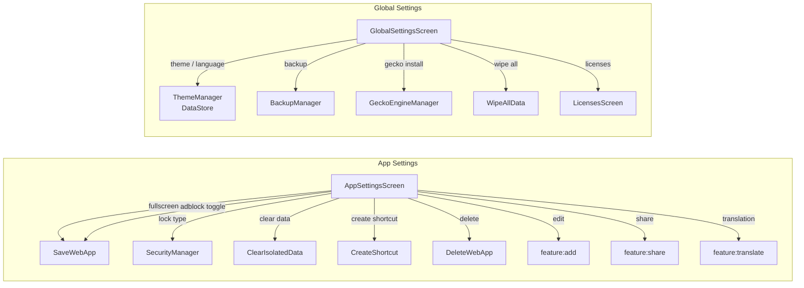

# `feature:settings`

> Fine-tune every PWA individually, or configure Shellify globally — two settings panels, one module.

## Overview

`feature:settings` contains two distinct but related settings surfaces:

1. **App Settings** — per-PWA controls: fullscreen, ad-block, translation, lock, user-agent, isolated data, shortcut, delete.
2. **Global Settings** — app-wide controls: theme, dynamic color, accent color, language, backup, GeckoView management, and a "wipe all data" option.

Both panels live in the same module because they share the same `core:*` dependencies and are typically navigated to from the same flows.

## Purpose

- Give users granular, per-app control over privacy and UX features without requiring developer knowledge.
- Provide app-wide configuration (theme, language, backup) in one central location.
- Surface third-party open-source acknowledgements via the `LicensesScreen`.

## Key Classes / Files

### `AppSettingsViewModel`

```kotlin
class AppSettingsViewModel(
    private val getWebAppById: GetWebAppById,
    private val saveWebApp: SaveWebApp,
    private val deleteWebApp: DeleteWebApp,
    private val clearIsolatedData: ClearIsolatedData,
    private val createShortcut: CreateShortcut,
    private val securityManager: SecurityManager,
) : ViewModel()
```

| Toggle / Action | Use case / Manager called |
|---|---|
| Fullscreen | `saveWebApp(app.copy(fullscreen = !fullscreen))` |
| Ad-block | `saveWebApp(app.copy(adBlockEnabled = !adBlockEnabled))` |
| Translation enabled | `saveWebApp(app.copy(translationConfig = ...))` |
| Lock type (NONE / PASSWORD / SYSTEM) | `securityManager.setLockType(webAppId, lockType)` + `saveWebApp` |
| User-agent mode | `saveWebApp(app.copy(userAgentMode = mode))` |
| Clear isolated data | `clearIsolatedData(webAppId)` |
| Create shortcut | `createShortcut(webApp)` |
| Delete | `deleteWebApp(webAppId)` → emit `NavigateToHome` |
| **Stealth mode** | `update { it.copy(stealthMode = !it.stealthMode) }` — hides PWA identity in Android recents |
| **Cookie auto-wipe** | `update { it.copy(cookieAutoWipe = !it.cookieAutoWipe) }` — triggers `IsolationManager.clearData` on `onStop` |
| **Always incognito** | `update { it.copy(alwaysIncognito = !it.alwaysIncognito) }` — every launch uses an ephemeral session |
| **Tracker blocking** | `update { it.copy(trackerBlockingEnabled = !it.trackerBlockingEnabled) }` — enables EasyPrivacy domain list in `AdBlocker` |

### Privacy section in `AppSettingsScreen` (Phase 2)

A new **Privacy** section was inserted between the **Control center** section and the **Browser Engine** section. It contains 4 toggle rows backed by the methods above:

1. Stealth mode — `Icons.Default.VisibilityOff`
2. Auto-wipe cookies — `Icons.Default.Delete` (CleaningServices fallback)
3. Always incognito — `Icons.Default.VisibilityOff`
4. Block trackers — `Icons.Default.Security` (TrackChanges fallback)

### Tor section in `AppSettingsScreen` (Phase 2, Plan 05)

A **Tor** section was inserted after the **Browser Engine** section. It contains:

1. **Route through Tor** toggle (`settings_tor_enable`) — enabled only when `engineType == GECKOVIEW`.
   When `SystemWebView` is selected, an info banner (`settings_tor_requires_gecko`) is shown instead.
2. **Preserve Tor identity** toggle (`settings_tor_preserve_identity`) — visible only when `useTor == true`.
   When enabled, a stable circuit is reused across sessions for the same app.
3. **New Tor identity** clickable row (`settings_tor_new_identity`) — visible only when `useTor == true`.
   Clicking emits `AppSettingsCommand.NewTorIdentity`, which is forwarded by the NavHost caller to
   `ShellifyApplication.torManager.newIdentity()`. Activities and NavHost may access `core:*`
   infrastructure directly per CLAUDE.md §Known gap.

New `AppSettingsViewModel` methods:

| Method | Effect |
|---|---|
| `toggleUseTor()` | Flips `WebApp.useTor` and persists |
| `togglePreserveTorIdentity()` | Flips `WebApp.preserveTorIdentity` and persists |
| `onNewTorIdentity()` | Emits `AppSettingsCommand.NewTorIdentity` |

### `AppSettingsScreen`

```kotlin
@Composable
fun AppSettingsScreen(
    webAppId: String,
    viewModel: AppSettingsViewModel,
    onNavigateToTranslate: (String) -> Unit,
    onNavigateToEdit: (String) -> Unit,
    onNavigateToShare: (String) -> Unit,
    onNavigateBack: () -> Unit,
)
```

Sections: **General** (fullscreen, UA mode) | **Privacy** (ad-block, isolated data, lock) | **Translation** | **Shortcut** | **Danger zone** (delete).

### `GlobalSettingsViewModel`

```kotlin
class GlobalSettingsViewModel(
    private val themeManager: ThemeManager,
    private val backupManager: BackupManager,
    private val geckoEngineManager: GeckoEngineManager,
    private val wipeAllData: WipeAllData,
) : ViewModel()
```

| Setting | Storage |
|---|---|
| Theme mode (Light/Dark/System) | `ThemeManager` → DataStore |
| Dynamic color | `ThemeManager` → DataStore |
| Accent color | `ThemeManager` → DataStore |
| Language (en/fr/ar) | `ThemeManager.selectedLanguage` → DataStore + `AppCompatDelegate` |
| Backup location + schedule | `BackupManager` |
| GeckoView install / uninstall | `GeckoEngineManager.install()` / `.uninstall()` |
| Wipe all data | `WipeAllData` use case → clears Room DB + DataStore + isolated profiles |

### `GlobalSettingsScreen`

Sections: **Appearance** | **Language** | **Backup** | **Browser Engine** | **About** (version, licenses link) | **Danger zone** (wipe all).

### `LicensesScreen`

Auto-generated by the `aboutlibraries` Gradle plugin at build time. Lists all third-party dependencies with their license text. Navigated to from the About section of `GlobalSettingsScreen`.

## Dependencies

```kotlin
// feature/settings/build.gradle.kts
dependencies {
    implementation(project(":core:domain"))
    implementation(project(":core:engine"))
    implementation(project(":core:security"))
    implementation(project(":core:isolation"))
    implementation(project(":core:backup"))
    implementation(project(":core:theme"))
    implementation(project(":core:ui"))
}
```

Navigation targets (runtime):

- `feature:add` — "Edit app" button in `AppSettingsScreen`
- `feature:share` — "Share app" button in `AppSettingsScreen`
- `feature:translate` — "Configure translation" in `AppSettingsScreen`

## Usage / How to navigate here

### App Settings

```kotlin
composable("settings/{webAppId}") { backStackEntry ->
    AppSettingsScreen(
        webAppId = backStackEntry.arguments!!.getString("webAppId")!!,
        viewModel = viewModel(),
        onNavigateToTranslate = { navController.navigate("translate/$it") },
        onNavigateToEdit = { navController.navigate("add/$it") },
        onNavigateToShare = { navController.navigate("share/$it") },
        onNavigateBack = { navController.popBackStack() },
    )
}
```

Typically reached via long-press → "Settings" from `feature:home`, or from the `WebViewActivity` overflow menu.

### Global Settings

```kotlin
composable("global-settings") {
    GlobalSettingsScreen(viewModel = viewModel(), onNavigateBack = { ... })
}
```

Reached from the top-bar overflow menu on `HomeScreen`.

## Mermaid Diagram



## Configuration

- **aboutlibraries**: configured in the root `build.gradle.kts`. The generated `aboutlibraries.json` is bundled in `feature/settings/src/main/res/raw/`. Rebuild after adding new dependencies to refresh the list.
- **GeckoView install UI**: the GeckoView install/uninstall buttons are only rendered when `GeckoEngineManager.isAvailable()` or the device supports it. Wrap in a feature flag if GeckoView is not shipped in the base APK.
- **Wipe confirmation**: `WipeAllData` is guarded by a two-step confirmation dialog (first tap: show warning; second tap: execute). Do not skip this guard — it is irreversible.
- **Backup storage**: configured via SAF (Storage Access Framework) `Uri` picker. The selected `Uri` is persisted in DataStore by `BackupManager`.
