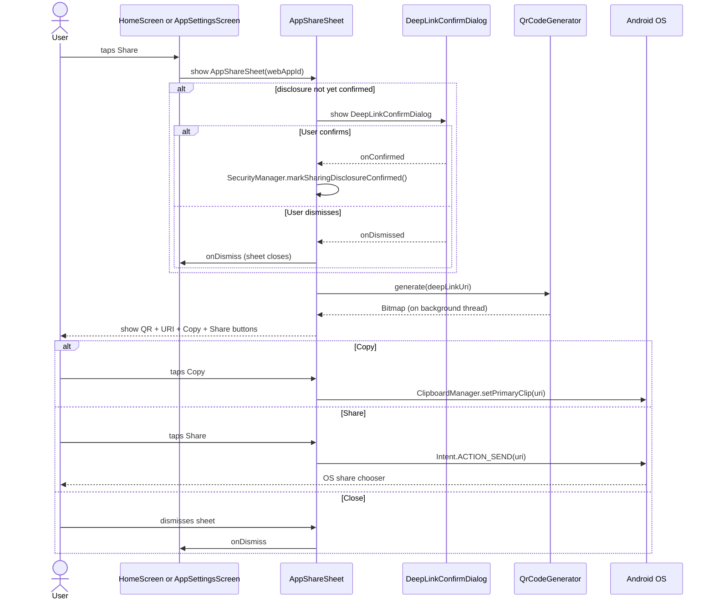

# `feature:share`

> Export any saved PWA as a QR code or a deep link — privacy disclosures included.

## Overview

`feature:share` provides a modal bottom sheet that lets users share a saved `WebApp` with others. It generates a QR code and a copyable URI using the `shellify://add?...` deep-link scheme, then offers standard OS sharing. All sharing actions are gated behind a legal disclosure that the user must have acknowledged.

## Purpose

- Generate a scannable QR code from a `WebApp`'s URL and name using ZXing via `QrCodeGenerator`.
- Provide "Copy link" and "Share" (OS share sheet) actions for the generated deep-link URI.
- Surface a visible privacy warning so users understand that sharing exposes the PWA's URL to the recipient.
- Enforce that the user has confirmed the sharing disclosure (a legal requirement tracked in `core:security`).

## Key Classes / Files

### `AppShareSheet`

```kotlin
@Composable
fun AppShareSheet(
    webAppId: String,
    onDismiss: () -> Unit,
)
```

A `ModalBottomSheet` Composable. Internal structure:

| Section | Detail |
|---|---|
| Header | App name + icon (loaded via Coil) |
| QR image | `Image(bitmap = qrBitmap)` generated by `QrCodeGenerator`; 240 × 240 dp |
| URI label | Selectable text showing the `shellify://add?url=...&name=...` URI |
| Copy button | `ClipboardManager.setPrimaryClip(...)` |
| Share button | `Intent.ACTION_SEND` with `text/plain` MIME; opens OS share chooser |
| Disclosure notice | Amber warning card: "Sharing this link will expose the app URL to the recipient." |
| Close | Sheet drag-to-dismiss or explicit close icon |

### `QrCodeGenerator`

```kotlin
class QrCodeGenerator {
    fun generate(content: String, sizePx: Int = 512): Bitmap
}
```

Thin wrapper around ZXing's `QRCodeWriter`. Produces a `Bitmap` synchronously on a background coroutine (called inside `LaunchedEffect` in `AppShareSheet`).

### `DeepLinkConfirmDialog`

```kotlin
@Composable
fun DeepLinkConfirmDialog(
    onConfirmed: () -> Unit,
    onDismissed: () -> Unit,
)
```

One-time confirmation dialog shown if `SecurityManager.hasSharingDisclosureBeenConfirmed()` returns `false`. Stores the confirmation to avoid showing it on every share action.

## Dependencies

```kotlin
// feature/share/build.gradle.kts
dependencies {
    implementation(project(":core:deeplink"))
    implementation(project(":core:domain"))
    implementation(project(":core:security"))
    implementation(project(":core:ui"))
}
```

ZXing is pulled in transitively through `core:deeplink` (or declared directly if `QrCodeGenerator` lives in this module):

```kotlin
implementation(libs.zxing.core)
```

## Usage / How to navigate here

`AppShareSheet` is invoked as an overlay — not a full screen — so it is displayed over the current destination rather than navigated to:

```kotlin
// From feature:home long-press menu:
if (showShareSheet) {
    AppShareSheet(
        webAppId = selectedApp.id,
        onDismiss = { showShareSheet = false },
    )
}
```

```kotlin
// From feature:settings share button:
AppShareSheet(
    webAppId = webAppId,
    onDismiss = { /* close */ },
)
```

## Mermaid Diagram



## Configuration

- **Deep-link URI format**: `shellify://add?url=<encoded>&name=<encoded>`. Built by `core:deeplink`'s `DeepLinkBuilder`; do not construct the URI manually in this module.
- **QR code size**: defaults to 512 px for the generated `Bitmap`; displayed at 240 dp. Adjust `sizePx` in `QrCodeGenerator.generate()` if the QR density is insufficient for long URLs.
- **Disclosure persistence**: the confirmation flag is stored in `SecurityManager`'s DataStore preferences keyed by `SHARING_DISCLOSURE_CONFIRMED`. It is a one-time per-install flag (not per-app), so users see the dialog only once across all their sharing actions.
- **ZXing version**: pinned in `libs.versions.toml`. Upgrade carefully — ZXing is stable but the public API surface for `QRCodeWriter` has historically been consistent across minor versions.
