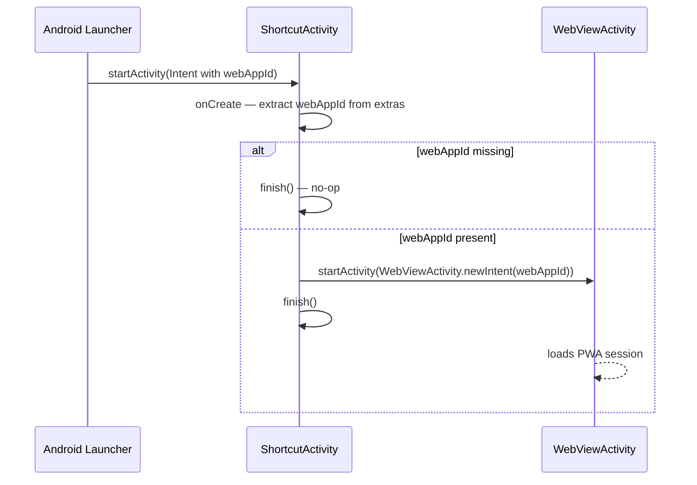

# `feature:shortcut`

> A transparent trampoline activity that routes launcher shortcut taps directly into a PWA session.

## Overview

`feature:shortcut` is a minimal, UI-less module that exists for one reason: Android requires that pinned launcher shortcuts target a concrete `Activity` class registered in the manifest. `ShortcutActivity` fulfils this contract without introducing any coupling between the shortcut infrastructure and `WebViewActivity` itself.

## Purpose

- Receive the `Intent` fired when the user taps a pinned home-screen shortcut.
- Extract the `webAppId` from the intent extras.
- Immediately start `WebViewActivity` with that ID and finish itself.
- Keep `:feature:webview` and `:core:shortcut` decoupled from launcher/manifest concerns.

## Key Classes / Files

### `ShortcutActivity`

```kotlin
class ShortcutActivity : AppCompatActivity() {
    override fun onCreate(savedInstanceState: Bundle?) {
        super.onCreate(savedInstanceState)
        val webAppId = intent.getStringExtra(EXTRA_WEB_APP_ID)
            ?: run { finish(); return }
        startActivity(WebViewActivity.newIntent(this, webAppId))
        finish()
    }
}
```

- No layout is inflated — `setContentView` is never called.
- `android:theme="@android:style/Theme.NoDisplay"` prevents any window flash.
- Calls `finish()` immediately after forwarding, so it never appears in the back stack.

## Dependencies

```kotlin
// feature/shortcut/build.gradle.kts
plugins {
    alias(libs.plugins.shellify.android.library)
    // No Compose — this module has zero UI
}

dependencies {
    implementation(project(":core:shortcut"))
    implementation(project(":feature:webview"))
}
```

`core:shortcut` provides the `EXTRA_WEB_APP_ID` constant and the shortcut intent contract. `feature:webview` provides `WebViewActivity.newIntent(...)`.

## Usage / How to navigate here

`ShortcutActivity` is never navigated to programmatically from within the app. It is only reached via the Android launcher when the user taps a pinned shortcut.

**Manifest declaration** (in `:app/AndroidManifest.xml`):

```xml
<activity
    android:name="io.shellify.feature.shortcut.ShortcutActivity"
    android:exported="true"
    android:theme="@android:style/Theme.NoDisplay"
    android:excludeFromRecents="true" />
```

`android:exported="true"` is required because the launcher fires the intent from outside the app process.

**Shortcut creation** (handled by `core:shortcut`'s `PwaShortcutManager`):

```kotlin
val shortcutIntent = Intent(context, ShortcutActivity::class.java)
    .putExtra(EXTRA_WEB_APP_ID, webApp.id)
    .setAction(Intent.ACTION_VIEW)

ShortcutManagerCompat.requestPinShortcut(
    context,
    ShortcutInfoCompat.Builder(context, webApp.id)
        .setShortLabel(webApp.name)
        .setIcon(IconCompat.createWithBitmap(iconBitmap))
        .setIntent(shortcutIntent)
        .build(),
    null,
)
```

## Mermaid Diagram



## Configuration

- **No display theme**: the `Theme.NoDisplay` theme prevents any window from appearing while `ShortcutActivity` is alive. If the Android version requires a visible window (rare edge case on some OEM launchers), switch to `Theme.Translucent.NoTitleBar`.
- **Back stack**: because `ShortcutActivity` calls `finish()` immediately, the user's back press from `WebViewActivity` returns to the launcher — not to `ShortcutActivity`. This is the correct behaviour for a shortcut launch.
- **Multiple PWA shortcuts**: each shortcut carries its own `webAppId` extra, so multiple shortcuts for different PWAs all target the same `ShortcutActivity` class — Android differentiates them by the intent extra, not by activity class.
