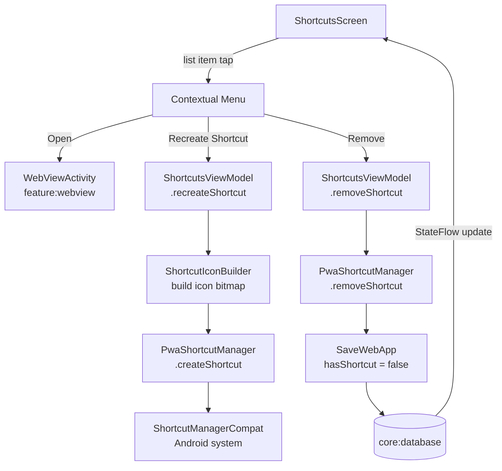

# `feature:shortcuts`

> Browse and manage every home-screen shortcut you've pinned for your PWAs.

## Overview

`feature:shortcuts` (plural) is the management screen for pinned launcher shortcuts. It is entirely distinct from `feature:shortcut` (singular), which is the trampoline activity. This module shows a list of all `WebApp` entries that have a pinned shortcut, and lets the user open, recreate, or remove them.

## Purpose

- Give users visibility into which of their PWAs have home-screen shortcuts.
- Allow recreation of a shortcut (useful when icons change or shortcuts break after an icon update).
- Allow removal of a shortcut from within the app, without requiring the user to find and long-press the icon on the launcher.

## Key Classes / Files

### `ShortcutsViewModel`

```kotlin
class ShortcutsViewModel(
    private val getWebApps: GetWebApps,
    private val saveWebApp: SaveWebApp,
    private val pwaShortcutManager: PwaShortcutManager,
    private val shortcutIconBuilder: ShortcutIconBuilder,
) : ViewModel()
```

| Responsibility | Detail |
|---|---|
| Shortcut list | `StateFlow<List<WebApp>>` — `GetWebApps` filtered by `webApp.hasShortcut == true` |
| Open | Emits `NavigateToWebView(webApp.id)` one-shot effect |
| Recreate shortcut | `shortcutIconBuilder.build(webApp)` → `pwaShortcutManager.createShortcut(webApp, icon)` |
| Remove shortcut | `pwaShortcutManager.removeShortcut(webApp.id)` → `saveWebApp(webApp.copy(hasShortcut = false))` → list updates automatically |

### `ShortcutsScreen`

```kotlin
@Composable
fun ShortcutsScreen(
    viewModel: ShortcutsViewModel,
    onNavigateToWebView: (String) -> Unit,
    onNavigateToAddApp: () -> Unit,
    onNavigateBack: () -> Unit,
)
```

| UI element | Behaviour |
|---|---|
| Shortcut list | `LazyColumn` of `ShortcutRow` items |
| `ShortcutRow` | App icon + name + URL; trailing `IconButton` opens a three-item contextual `DropdownMenu` |
| Contextual menu | **Open** / **Recreate shortcut** / **Remove** |
| Empty state | "No shortcuts yet" placeholder with a CTA button that routes back to `HomeScreen` to pick an app |
| "Add shortcut" FAB or header action | Navigates to `HomeScreen` (`onNavigateToAddApp`); once a `WebApp` is selected there, `AppSettingsScreen` creates the shortcut |

## Dependencies

```kotlin
// feature/shortcuts/build.gradle.kts
dependencies {
    implementation(project(":core:domain"))
    implementation(project(":core:iconpack"))
    implementation(project(":core:pwa"))
    implementation(project(":core:shortcut"))
    implementation(project(":core:ui"))
}
```

## Usage / How to navigate here

Reached from the global settings or from a dedicated entry in the app's main navigation drawer / bottom bar:

```kotlin
// app NavGraph
composable("shortcuts") {
    ShortcutsScreen(
        viewModel = viewModel(),
        onNavigateToWebView = { webAppId ->
            context.startActivity(WebViewActivity.newIntent(context, webAppId))
        },
        onNavigateToAddApp = { navController.navigate("home") },
        onNavigateBack = { navController.popBackStack() },
    )
}
```

## Mermaid Diagram



## Configuration

- **Difference from `feature:shortcut`**: `feature:shortcuts` is a Compose screen for managing shortcuts inside the app. `feature:shortcut` is an `Activity` that the Android launcher calls. They share `core:shortcut` infrastructure but have no direct dependency on each other.
- **Recreate behaviour**: `ShortcutManagerCompat` on Android 7.1+ supports `updateShortcuts()` for dynamic shortcuts and `requestPinShortcut()` for pinned ones. Because pinned shortcuts cannot be silently updated (the user must accept a new pin request on some launchers), `recreateShortcut` calls `createShortcut` which may show a system dialog asking the user to re-pin.
- **Icon rebuild**: `ShortcutIconBuilder` is in `core:shortcut`. It composites the PWA icon onto a rounded-rectangle background matching the app's theme color, producing the same adaptive-icon-style bitmap used when the shortcut was first created.
- **List ordering**: shortcuts are displayed in the same order as `GetWebApps` returns them (insertion order / alphabetical depending on `core:database` sort). No separate ordering is applied at this layer.
