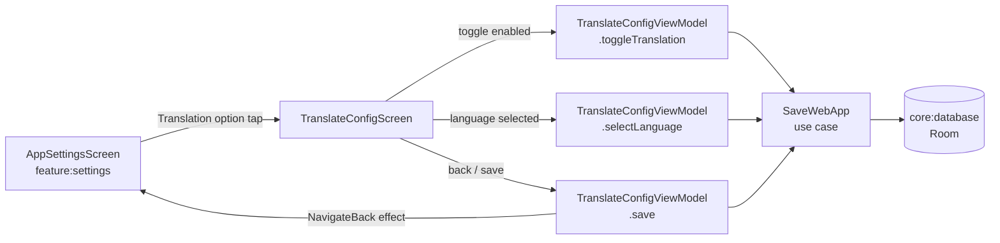

# `feature:translate`

> Pick a target language and Shellify will translate every page in that PWA automatically.

## Overview

`feature:translate` is a focused single-screen module for configuring the per-app translation feature. Users enable or disable automatic translation for a specific `WebApp` and select one of 16 supported target languages. Changes are persisted immediately via the `SaveWebApp` use case so `feature:webview` picks them up on the next session.

## Purpose

- Toggle automatic translation on or off for a single `WebApp`.
- Present a list of 16 supported target languages and let the user choose one.
- Show the current auto-detected source language (informational, read-only).
- Persist the updated `TranslationConfig` to the database and navigate back.

## Key Classes / Files

### `TranslateConfigViewModel`

```kotlin
class TranslateConfigViewModel(
    private val getWebAppById: GetWebAppById,
    private val saveWebApp: SaveWebApp,
) : ViewModel()
```

| Responsibility | Detail |
|---|---|
| Load config | `init { getWebAppById(webAppId) }` → populates `uiState` with current `translationConfig` |
| Toggle enabled | `toggleTranslation(enabled: Boolean)` → `saveWebApp(app.copy(translationConfig = config.copy(enabled = enabled)))` |
| Select language | `selectLanguage(language: TranslateLanguage)` → `saveWebApp(...)` |
| Save + navigate | `save()` → emits `NavigateBack` effect after persisting |

### `TranslateConfigScreen`

```kotlin
@Composable
fun TranslateConfigScreen(
    webAppId: String,
    viewModel: TranslateConfigViewModel,
    onNavigateBack: () -> Unit,
)
```

| UI element | Behaviour |
|---|---|
| Enable toggle | `Switch` at top; when off, language list is greyed out but remains visible |
| Source language row | Read-only text: "Detected source: Auto" |
| Target language list | `LazyColumn` of `RadioButton` rows for each of the 16 languages |
| Save / Back | Top bar back arrow auto-saves on dismiss (or explicit Save button at bottom) |

**Supported target languages** (16):

English, Chinese, Spanish, French, German, Arabic, Japanese, Korean, Portuguese, Russian, Italian, Dutch, Polish, Turkish, Hindi, Vietnamese.

These correspond to values in the `TranslateLanguage` enum in `core:domain`.

## Dependencies

```kotlin
// feature/translate/build.gradle.kts
dependencies {
    implementation(project(":core:domain"))
    implementation(project(":core:ui"))
}
```

`feature:translate` deliberately has no dependency on `core:engine` or `core:translate` — it only persists the *configuration*. The actual `TranslateBridge` injection at browse time is handled by `feature:webview` using the saved config.

## Usage / How to navigate here

Reached exclusively from `AppSettingsScreen` in `feature:settings`:

```kotlin
// In AppSettingsScreen:
onNavigateToTranslate = { webAppId ->
    navController.navigate("translate/$webAppId")
}

// app NavGraph:
composable("translate/{webAppId}") { backStackEntry ->
    TranslateConfigScreen(
        webAppId = backStackEntry.arguments!!.getString("webAppId")!!,
        viewModel = viewModel(),
        onNavigateBack = { navController.popBackStack() },
    )
}
```

## Mermaid Diagram



## Configuration

- **Language list**: the 16 supported languages are defined in the `TranslateLanguage` enum in `core:domain`. To add a new language, extend the enum there and the radio list in `TranslateConfigScreen` will pick it up automatically via `TranslateLanguage.entries`.
- **Auto-save vs explicit save**: the current implementation saves on every toggle and language selection change (no "Cancel" path). If an explicit save/cancel pattern is needed, buffer changes in a local `MutableStateFlow` and only call `saveWebApp` when the user taps Save.
- **Source language detection**: source language detection is performed at runtime by `TranslateBridge` in `feature:webview` using the page's `<html lang>` attribute or ML Kit language ID. `feature:translate` does not perform any detection — it only stores the target preference.
- **No network in this module**: translation itself is done client-side (via `core:translate`'s bridge). This module touches only DataStore and Room through the use case layer.
