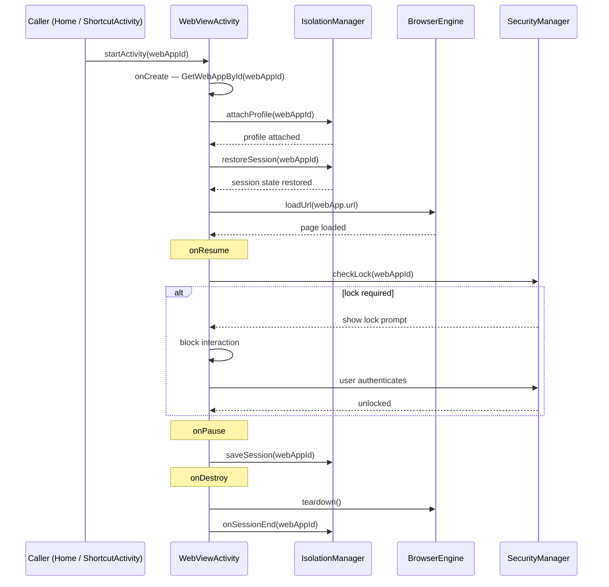

# `feature:webview`

> The full-screen browser that turns a saved PWA into a real app experience.

## Overview

`feature:webview` is the only non-Compose module in the `feature/` tree. It hosts `WebViewActivity`, a traditional `AppCompatActivity` that integrates the chosen browser engine (System WebView or GeckoView), applies per-app isolation, injects ad-blocking and translation, enforces the lock screen, and manages the fullscreen window state.

## Purpose

- Launch any saved `WebApp` in its own isolated browsing context.
- Apply the per-app engine selection at startup (system WebView vs. GeckoView).
- Inject the `AdBlocker` content blocker when `webApp.adBlockEnabled` is true.
- Inject the `TranslateBridge` JavaScript bridge when translation is enabled.
- Show a lock prompt (password or biometric) on every resume if a lock type is configured.
- Hide/show the status bar according to `webApp.fullscreen`.
- Persist and restore the browsing session across process restarts via `IsolationManager`.

## Key Classes / Files

### `WebViewActivity`

```kotlin
class WebViewActivity : AppCompatActivity(), WebViewServiceProvider
```

**Intent contract**

```kotlin
// Launch from anywhere:
val intent = Intent(context, WebViewActivity::class.java)
    .putExtra(EXTRA_WEB_APP_ID, webApp.id)
context.startActivity(intent)
```

**Lifecycle responsibilities**

| Lifecycle method | Action |
|---|---|
| `onCreate` | Retrieve `webAppId` → `GetWebAppById` → `attachProfile()` → `restoreSession()` → `loadUrl()` |
| `onResume` | If lock type != NONE: show lock prompt; block interaction until unlocked |
| `onPause` | `IsolationManager.saveSession(webAppId)` |
| `onDestroy` | Engine teardown; `IsolationManager.onSessionEnd(webAppId)` |
| `onBackPressed` | If engine can go back: `engine.goBack()`; else: `finish()` |

**Feature toggles applied in `onCreate`**

| Feature | Condition | Call |
|---|---|---|
| Ad-block | `webApp.adBlockEnabled` | `adBlocker.inject(engineView)` |
| Translation | `webApp.translationConfig.enabled` | `translateBridge.attach(engineView, targetLanguage)` |
| Fullscreen | `webApp.fullscreen` | `WindowInsetsControllerCompat.hide(SYSTEM_BARS)` |
| Engine type | `webApp.engineType == GECKO` | swap `GeckoViewEngine` for `SystemWebViewEngine` |

### `WebViewServiceProvider`

Interface that `ShellifyApplication` implements. `WebViewActivity` casts `applicationContext` to this interface to obtain its dependencies without a DI framework:

```kotlin
interface WebViewServiceProvider {
    val themeManager: ThemeManager
    val passwordManager: PasswordManager
    val geckoEngineManager: GeckoEngineManager
    val adBlocker: AdBlocker
    val isolationManager: IsolationManager
    val saveWebApp: SaveWebApp
    val getWebAppById: GetWebAppById
}
```

## Dependencies

```kotlin
// feature/webview/build.gradle.kts
plugins {
    alias(libs.plugins.shellify.android.library)
    // NOTE: shellify.compose is NOT applied — no Compose in this module
}

dependencies {
    implementation(project(":core:domain"))
    implementation(project(":core:engine"))
    implementation(project(":core:isolation"))
    implementation(project(":core:security"))
    implementation(project(":core:translate"))
    implementation(project(":core:ui"))
}
```

## Usage / How to navigate here

`WebViewActivity` must be started via an explicit `Intent` (not NavController) because it is an `Activity`, not a Composable:

```kotlin
// From HomeScreen card tap:
val intent = WebViewActivity.newIntent(context, webAppId = webApp.id)
context.startActivity(intent)
```

It is also the target of `feature:shortcut`'s `ShortcutActivity` trampoline.

## Mermaid Diagram



## Configuration

- **Manifest registration**: `WebViewActivity` must be declared in `:app/AndroidManifest.xml` with `android:exported="false"` (launched only by internal intents) and `android:launchMode="singleTask"` to prevent multiple instances of the same PWA.
- **GeckoView runtime**: initialized lazily by `GeckoEngineManager` in `ShellifyApplication.onCreate()`. If GeckoView is not bundled, `geckoEngineManager.isAvailable()` returns `false` and the activity falls back to system WebView automatically.
- **Fullscreen handling**: uses `WindowInsetsControllerCompat` (Jetpack) for API-agnostic status/nav bar hiding. The window flag `FLAG_KEEP_SCREEN_ON` is set when fullscreen is active.
- **Ad-block lists**: filter lists are loaded from `core:engine`'s bundled assets on first engine start. No network fetch at browse time.
