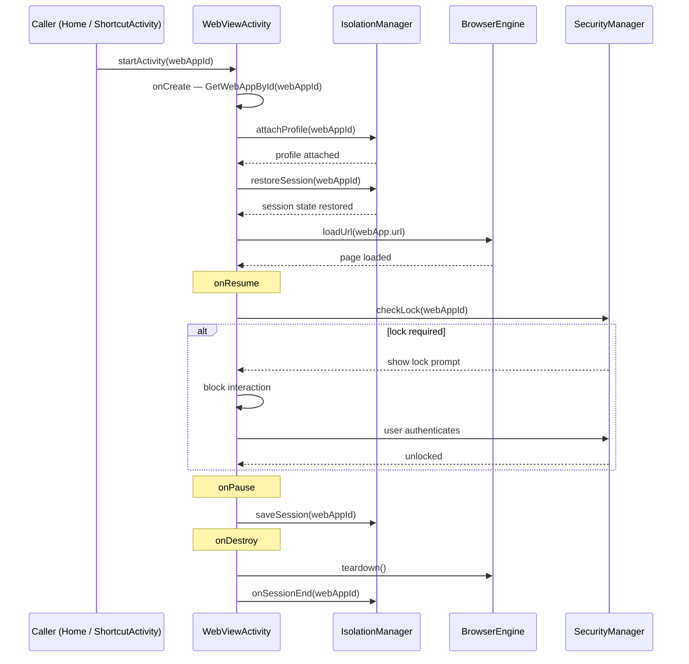

# `feature:webview`

> The full-screen browser that turns a saved PWA into a real app experience.

## Overview

`feature:webview` is the only non-Compose module in the `feature/` tree. It hosts `WebViewActivity`, a traditional `AppCompatActivity` that integrates the chosen browser engine (System WebView or GeckoView), applies per-app isolation, injects ad-blocking and translation, enforces the lock screen, and manages the fullscreen window state.

## Purpose

- Launch any saved `WebApp` in its own isolated browsing context.
- Apply the per-app engine selection at startup (system WebView vs. GeckoView).
- Inject the `AdBlocker` content blocker when `webApp.adBlockEnabled` is true.
- Inject the `TranslateBridge` JavaScript bridge when translation is enabled.
- Show a lock prompt (password or biometric) on every resume if a lock type is configured.
- Hide/show the status bar according to `webApp.fullscreen`.
- Persist and restore the browsing session across process restarts via `IsolationManager`.

## Key Classes / Files

### `WebViewActivity`

```kotlin
class WebViewActivity : AppCompatActivity(), WebViewServiceProvider
```

**Intent contract**

```kotlin
// Launch from anywhere:
val intent = Intent(context, WebViewActivity::class.java)
    .putExtra(EXTRA_WEB_APP_ID, webApp.id)
context.startActivity(intent)
```

**Lifecycle responsibilities**

| Lifecycle method | Action |
|---|---|
| `onCreate` | Retrieve `webAppId` → `GetWebAppById` → `attachProfile()` → `restoreSession()` → `loadUrl()` |
| `onResume` | If lock type != NONE: show lock prompt; block interaction until unlocked |
| `onPause` | `IsolationManager.saveSession(webAppId)` |
| `onDestroy` | Engine teardown; `IsolationManager.onSessionEnd(webAppId)` |
| `onBackPressed` | If engine can go back: `engine.goBack()`; else: `finish()` |

**Feature toggles applied in `onCreate`**

| Feature | Condition | Call |
|---|---|---|
| Ad-block | `webApp.adBlockEnabled` | `adBlocker.inject(engineView)` |
| Translation | `webApp.translationConfig.enabled` | `translateBridge.attach(engineView, targetLanguage)` |
| Fullscreen | `webApp.fullscreen` | `WindowInsetsControllerCompat.hide(SYSTEM_BARS)` |
| Engine type | `webApp.engineType == GECKO` | swap `GeckoViewEngine` for `SystemWebViewEngine` |

### `WebViewServiceProvider`

Interface that `ShellifyApplication` implements. `WebViewActivity` casts `applicationContext` to this interface to obtain its dependencies without a DI framework:

```kotlin
interface WebViewServiceProvider {
    val themeManager: ThemeManager
    val passwordManager: PasswordManager
    val geckoEngineManager: GeckoEngineManager
    val adBlocker: AdBlocker
    val isolationManager: IsolationManager
    val saveWebApp: SaveWebApp
    val getWebAppById: GetWebAppById
}
```

## Dependencies

```kotlin
// feature/webview/build.gradle.kts
plugins {
    alias(libs.plugins.shellify.android.library)
    // NOTE: shellify.compose is NOT applied — no Compose in this module
}

dependencies {
    implementation(project(":core:domain"))
    implementation(project(":core:engine"))
    implementation(project(":core:isolation"))
    implementation(project(":core:security"))
    implementation(project(":core:translate"))
    implementation(project(":core:ui"))
}
```

## Usage / How to navigate here

`WebViewActivity` must be started via an explicit `Intent` (not NavController) because it is an `Activity`, not a Composable:

```kotlin
// From HomeScreen card tap:
val intent = WebViewActivity.newIntent(context, webAppId = webApp.id)
context.startActivity(intent)
```

It is also the target of `feature:shortcut`'s `ShortcutActivity` trampoline.

## Mermaid Diagram



## Configuration

- **Manifest registration**: `WebViewActivity` must be declared in `:app/AndroidManifest.xml` with `android:exported="false"` (launched only by internal intents) and `android:launchMode="singleTask"` to prevent multiple instances of the same PWA.
- **GeckoView runtime**: initialized lazily by `GeckoEngineManager` in `ShellifyApplication.onCreate()`. If GeckoView is not bundled, `geckoEngineManager.isAvailable()` returns `false` and the activity falls back to system WebView automatically.
- **Fullscreen handling**: uses `WindowInsetsControllerCompat` (Jetpack) for API-agnostic status/nav bar hiding. The window flag `FLAG_KEEP_SCREEN_ON` is set when fullscreen is active.
- **Ad-block lists**: filter lists are loaded from `core:engine`'s bundled assets on first engine start. No network fetch at browse time.

## Phase 2 Privacy Additions

### Stealth mode — `applyTaskDescription`

`WebViewActivity.applyTaskDescription(app)` is called from `onResume()`. When `app.stealthMode = true`, the Activity shows generic Shellify branding (`R.string.app_name`, null icon, white background) instead of the PWA's name and icon in Android recents. Per D-01: stealth mode prevents observers from identifying which PWA the user is browsing.

### Cookie auto-wipe — `onStop`

`WebViewActivity.onStop()` calls `viewModel.onSessionStop()`. When `app.cookieAutoWipe = true`, the ViewModel launches `isolationManager.clearData(isolationId)` in `viewModelScope`. Per D-05: auto-wipe is a separate concern from incognito — it keeps cookies during the session but clears on close.

### alwaysIncognito — `initWithApp`

When `app.alwaysIncognito = true` and the intent does not already have `EXTRA_INCOGNITO = true`, `initWithApp` sets `isIncognitoSession = true` and assigns a fresh ephemeral `isolationId` before the WebView is constructed. This ensures `onDestroy` clears the ephemeral profile while leaving the persisted `app.isolationId` untouched.

### Control center rows

`WebViewControlCenterSheet` gained two new rows:
- **Stealth mode** — `Switch` bound to `app.stealthMode`, callback `onStealthModeChanged` → `viewModel.onStealthModeChanged(on)` → saves updated app.
- **Open incognito** — clickable row (no Switch), callback `onOpenIncognito` → `startActivity(incognitoIntent(context, pwaApp.url))` in the Activity.

### Panic button — PRIV-04

**Icon placement:** A `Warning` icon is rendered in the top-right toolbar area via a dedicated `addPanicOverlay()` composable overlay. It uses `statusBarsPadding()` to sit just below the status bar.

**Long-press threshold:** `detectTapGestures(onLongPress = { ... })` fires when the user holds for ≥2000ms (Compose's default threshold). `onPanicLongPress()` is called, setting `uiState.showPanicConfirm = true`.

**ConfirmDialog:** When `showPanicConfirm = true`, `ConfirmDialog` renders with:
- `icon = Icons.Default.Warning`, `isDestructive = true`
- title: `R.string.webview_panic_confirm_title` ("Wipe all data?")
- body: `R.string.webview_panic_confirm_body`
- confirm: `R.string.webview_panic_confirm_button` ("Wipe everything")
- onConfirm → `viewModel.executePanicWipe()`
- onDismiss → `viewModel.onPanicDismiss()`

**6-step wipe sequence** (in `WebViewViewModel.executePanicWipe()`):
1. `getWebApps().first().forEach { isolationManager.clearData(it.isolationId) }`
2. `deleteAllAppsUseCase()` — removes all rows from `web_apps` table (Room transaction)
3. `themeManager.clearAll()` — clears `pwa_theme` DataStore
4. `passwordManager.clearAll()` — clears `pwa_password` DataStore
5. `_uiState.update { it.copy(showPanicConfirm = false) }` — reset dialog state
6. `_commands.emit(WebViewCommand.NavigateHome)` — `collectCommands()` calls `finish()`

**NavigateHome handling:** `collectCommands()` in `WebViewActivity` handles `WebViewCommand.NavigateHome` by calling `finish()`. The back stack returns to `HomeScreen`, which now shows an empty app list.

### Tor integration — TOR-01 through TOR-05 + D-07

**TorManager wiring:** `ShellifyApplication` exposes `override val torManager by lazy { TorManager(this) }` and `WebViewServiceProvider` declares `val torManager: TorManager`. `WebViewViewModel.Factory` passes it through.

**Traffic-leak prevention gate (T-02-23):** `WebViewViewModel.onAppReady(app)` routes initial page loads. For Tor apps (`app.useTor == true`), it calls `torManager.ensureStarted(...)` and suspends until `torManager.torState.filter { it is TorState.Ready }.first()` before emitting `WebViewCommand.LoadUrl`. Non-Tor apps receive `LoadUrl` immediately. `WebViewActivity.startLoading()` calls `viewModel.onAppReady(pwaApp)` instead of `engine.loadUrl()` directly.

**ProxyConfig threading (GeckoViewEngine):** `GeckoViewEngine.proxyConfigFor(app)` returns `ProxyConfig.Socks5("127.0.0.1", 9050)` when `app.useTor == true`, else `ProxyConfig.None`. `createView()` and `buildSession()` pass this to `engineManager.getRuntime(proxyConfig)`, routing all GeckoView network traffic through the Tor SOCKS5 proxy.

**Bootstrap chip:** `addTorBootstrapChipOverlay()` adds a composable overlay in the top-left toolbar area. When `uiState.torState is TorState.Connecting`, an `AnimatedVisibility` block renders a pulsing `VpnLock` icon + `R.string.webview_tor_connecting` label (0.5→1.0 alpha, 1200ms repeat). The chip fades out (`tween(300)`) when the state transitions to `TorState.Ready`.

**Incognito badge:** The same overlay renders an `Icons.Default.VisibilityOff` badge (18dp, 72% alpha) when `uiState.isIncognitoSession == true`. The Activity calls `viewModel.onIncognitoSession()` after ViewModel creation when the incognito flag is set.

**Identity rotation:** `WebViewControlCenterSheet` shows a "New Tor identity" row (`Icons.Default.Refresh`, `R.string.webview_control_new_tor_identity`) only when `pwaApp.useTor == true`. Tap calls `viewModel.onNewTorIdentity()` → `torManager.newIdentity()` → emits `WebViewCommand.NewTorIdentityRequested`. The `torState` flow automatically cycles `Ready → Connecting → Ready` as the daemon establishes a new circuit.

**Session lifecycle:** `WebViewActivity.onStop()` calls `viewModel.onSessionStop()` which calls `torManager.releaseApp(app.id, app.preserveTorIdentity)` for Tor apps. The daemon shuts down after `TorManager.GRACE_PERIOD_MS` (30s) when all non-identity-preserving apps have released.
