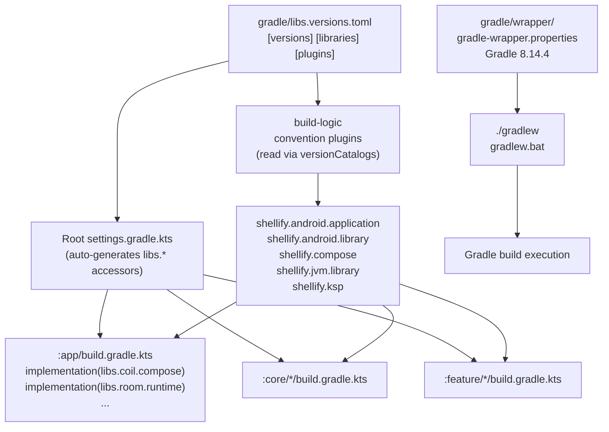

# gradle

> Gradle infrastructure — the wrapper that pins the build tool version and the version catalog that centralises every library declaration.

## Overview

The `gradle/` directory contains two things:

- `wrapper/` — Gradle Wrapper scripts and properties; ensures every developer and CI agent uses the same Gradle version without a local installation
  - `gradle-wrapper.properties` — distribution URL and checksum validation settings
  - `gradle-wrapper.jar` — bootstrap jar committed to VCS (do not edit manually)
- `libs.versions.toml` — Gradle Version Catalog; single source of truth for 100+ library and plugin versions; consumed by `build-logic` convention plugins and all module `build.gradle.kts` files

Current Gradle version: **8.14.4**

Key versions declared in `libs.versions.toml`:

| Library | Version |
|---|---|
| Kotlin | 2.0.21 |
| AGP (Android Gradle Plugin) | 8.7.3 |
| KSP | 2.0.21-1.0.28 |
| Compose BOM | 2024.12.01 |
| Room | 2.6.1 |
| SQLCipher | 4.5.4 |
| OkHttp | 4.12.0 |
| Coil | 2.7.0 |
| GeckoView | 128.0.20240704121409 |
| ZXing | 3.5.3 |
| WorkManager | 2.9.1 |
| Detekt | 1.23.7 |
| Roborazzi | 1.60.0 |
| Robolectric | 4.16.1 |

## Purpose

A version catalog prevents version conflicts across a multi-module project. Without it, each module could independently declare `implementation("some.lib:artifact:1.0.0")` and a neighbour could silently pull in `2.0.0`, leading to classpath conflicts. With `libs.versions.toml`, every module references the same alias and there is exactly one version per library in the entire project.

The Gradle Wrapper guarantees reproducible builds: `./gradlew` downloads the exact Gradle distribution declared in `gradle-wrapper.properties` and verifies its checksum, making the build identical on a new developer laptop, in CI, and on a release server.

## Usage

### Running a build

Use `./gradlew` (Unix) or `gradlew.bat` (Windows) — never a locally installed `gradle` binary:

```bash
./gradlew assembleDebug
./gradlew test
./gradlew :app:installDebug
```

### Adding a new dependency

1. Add the version to `[versions]` (skip if it already exists or if the library is managed by a BOM):

   ```toml
   [versions]
   mylib = "1.2.3"
   ```

2. Declare the library under `[libraries]`:

   ```toml
   [libraries]
   mylib-core = { group = "com.example", name = "mylib-core", version.ref = "mylib" }
   ```

3. Reference it in any module's `build.gradle.kts`:

   ```kotlin
   dependencies {
       implementation(libs.mylib.core)
   }
   ```

   Dots in the alias become dots in the accessor: `mylib-core` → `libs.mylib.core`.

### Adding a new Gradle plugin

```toml
[plugins]
myplugin = { id = "com.example.myplugin", version.ref = "mylib" }
```

Then apply it in a module:

```kotlin
plugins {
    alias(libs.plugins.myplugin)
}
```

### Updating the Gradle Wrapper

```bash
./gradlew wrapper --gradle-version 8.15.0 --distribution-type bin
# Commit the updated gradle-wrapper.properties (and gradle-wrapper.jar if changed)
```

### Viewing all outdated dependencies

```bash
./gradlew dependencyUpdates   # requires the Gradle Versions plugin
```

## Dependencies

`libs.versions.toml` is consumed by:

- `build-logic/settings.gradle.kts` — imported into the included build via `versionCatalogs { create("libs") { from(files("../gradle/libs.versions.toml")) } }`
- Root `settings.gradle.kts` — Gradle auto-generates a `libs` accessor for all modules in the main build

Nothing depends on `gradle/wrapper/` at compile time; the wrapper JAR is only executed by the `gradlew` shell script.

## Mermaid Diagram



## Configuration

### gradle-wrapper.properties

| Property | Value |
|---|---|
| `distributionUrl` | `https://services.gradle.org/distributions/gradle-8.14.4-bin.zip` |
| `validateDistributionUrl` | `true` (checksum enforced) |
| `networkTimeout` | 10 000 ms |

### libs.versions.toml structure

```
[versions]   — named version strings (e.g. kotlin = "2.0.21")
[libraries]  — artifact coordinates referencing a version
[plugins]    — Gradle plugin IDs referencing a version
[bundles]    — (not currently used) groups of libraries applied together
```

Avoid declaring a version inline in `[libraries]` — always use `version.ref` to keep the version string in `[versions]` where it is easy to find and update.
